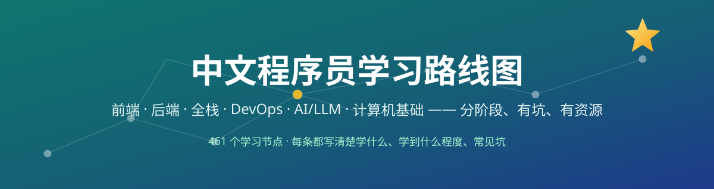

# 中文程序员学习路线图 🗺️

> **一份能陪你从入门到资深的中文路线图。** 前端、后端、全栈、DevOps、AI/LLM、计算机基础——六条主航道，每条都拆成「学什么 / 学到什么程度算过 / 常见坑 / 推荐资源」。**收藏这一份，路上不迷路。**

`roadmap-zh` 是一份**纯 Markdown 的中文程序员学习路线图合集**：参考国际上最受欢迎的开发者路线图的分阶段思路，**所有节点内容为原创中文撰写**，不翻译、不搬运。打开即用、可搜索、可打印。

## 为什么需要这份路线图

- 🧭 **不再「不知道下一步学什么」**：每个阶段都有过线标准，不是收藏一堆链接就完事。
- 🚧 **坑提前说**：每个节点都写了「常见坑」——这些都是前人踩过的。
- 🔗 **资源真实可达**：每条推荐链接都经过抽查验证（MDN、菜鸟教程、廖雪峰、Hugging Face、官方文档）。
- 📚 **六条主航道**：不管你是想做前端、后端、DevOps、AI，还是补计算机基础，都有对应路线。
- 🇨🇳 **全中文**：术语保留英文，解释全部中文，不用对着翻译软件硬啃。

## 速查索引（想学什么 → 打开哪张）

| 我想…… | 打开 |
| --- | --- |
| 做网页 / 小程序 / 中后台 | [前端工程师路线图](roadmaps/01-frontend.md) |
| 写接口 / 数据库 / 服务端 | [后端工程师路线图](roadmaps/02-backend.md) |
| 一个人把产品从数据库做到界面 | [全栈工程师路线图](roadmaps/03-fullstack.md) |
| 搞运维 / 容器 / CI-CD / 云原生 | [DevOps 工程师路线图](roadmaps/04-devops.md) |
| 做 AI 应用 / RAG / 微调 / Agent | [AI/LLM 工程师路线图](roadmaps/05-ai-llm.md) |
| 补计算机基础 / 操作系统 / 网络 / 算法 | [计算机基础路线图](roadmaps/06-cs-foundation.md) |

## 快速开始

```bash
git clone https://github.com/zieang88888/roadmap-zh.git
cd roadmap-zh
# 然后直接用浏览器 / Typora / VS Code 打开 roadmaps/ 下任意 .md
```

或者**什么都不用装**：在 GitHub 网页里直接点开 `roadmaps/` 下任意文件就能看。

**打印友好**：浏览器打开任意路线图 → `Ctrl+P` → 导出 PDF，就是一张可以贴在墙上的学习地图。

## 仓库结构

```
roadmap-zh/
├── README.md                      # 你正在看的这份
├── LICENSE                        # MIT
├── THIRD_PARTY_NOTICES.md         # 外部资源署名与合规声明
├── roadmaps/                      # 六张路线图
│   ├── 01-frontend.md             # 前端工程师（80 节点）
│   ├── 02-backend.md              # 后端工程师（80 节点）
│   ├── 03-fullstack.md            # 全栈工程师（68 节点）
│   ├── 04-devops.md               # DevOps 工程师（78 节点）
│   ├── 05-ai-llm.md               # AI/LLM 工程师（72 节点）
│   └── 06-cs-foundation.md        # 计算机基础（83 节点）
└── assets/
    └── banner.svg                 # 顶部横幅（原创 SVG）
```

## 内容示例（摘自前端路线图）

```markdown
- **44. 核心 Web 指标** —— 学什么：LCP/FID/CLS/INP 定义与测量。
  学到什么程度：能用 Lighthouse 跑分并说出三条优化项。
  常见坑：只看分数不看用户真实体验。
  资源：web.dev/vitals
```

每一条都长这样：**节点 / 学什么 / 过线标准 / 坑 / 资源**。

## 怎么用这份路线图

1. **先选一条主航道**，不要六条一起学。
2. **按阶段推进**，每个阶段结束做一个小项目复盘。
3. **不要收藏即学会**：节点看一遍不算学过，做出来东西才算。
4. **遇到坑就回来翻**：常见坑那一栏就是给你踩的时候看的。

## 质量承诺

- ✅ 全部节点为原创中文撰写，仅参考分阶段思路，不翻译不照搬
- ✅ 推荐链接经过抽查可达（MDN / 菜鸟教程 / 官方文档等）
- ✅ 无占位符、无"待补充"——打开就能照着学
- ❓ 发现链接失效或内容过时？开一个 [Issue](https://github.com/zieang88888/roadmap-zh/issues)，核实后第一时间修

## 星标理由（认真脸）

如果你现在刚入门，**Star 一下不会亏**——三个月后你回头找"下一步该学什么"时，就知道这份地图值多少了。⭐

## License

[MIT](LICENSE) © 2026 zieang88888

> 分阶段结构参考了国际知名开发者路线图项目 `kamranahmedse/developer-roadmap` 的组织思路；该项目采用自定义许可协议（禁止再分发内容），**本仓库未复制其任何文字，全部节点内容为原创中文撰写**。详见 [THIRD_PARTY_NOTICES.md](THIRD_PARTY_NOTICES.md)。

---

*愿每个想入行的人，都不再走弯路。*
