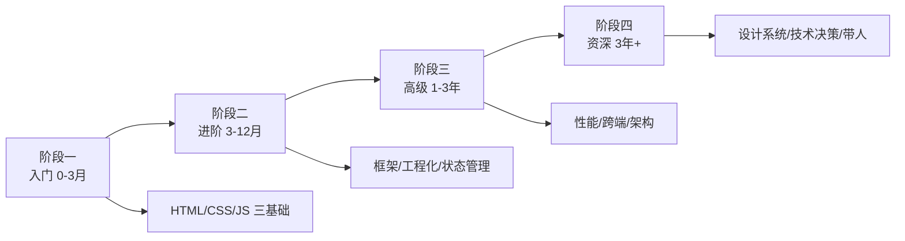

# 前端工程师学习路线图

> 从「会写网页」到「能负责一个前端团队的技术选型」，分四个阶段。每个节点都写清楚：学什么、学到什么程度算过、常见坑、推荐资源。

---

## 阶段一：入门 0-3 个月（打地基）

目标：能独立切出一个静态页面并加简单交互，理解浏览器到底怎么跑代码。

- **1. HTML 语义化** —— 学什么：`header/nav/main/article/section/footer` 等标签，不要全用 div。学到什么程度：写出来的页面屏幕阅读器能读通。常见坑：为了样式乱用 `
`，SEO 和无障碍全丢。资源：[MDN HTML 基础](https://developer.mozilla.org/zh-CN/docs/Web/HTML)
- **2. 表单与表单校验** —— 学什么：`input/select/textarea` 类型、`required/pattern`、提交事件。学到什么程度：不依赖框架也能写一个可用的登录表单。常见坑：只做前端校验忘了后端也要校验。资源：[MDN 表单教程](https://developer.mozilla.org/zh-CN/docs/Learn_web_development/Extensions/Forms)
- **3. CSS 选择器与盒模型** —— 学什么：元素/类/ID/后代选择器，`content+padding+border+margin` 盒模型，`box-sizing`。学到什么程度：能说清一个元素真实占位多宽。常见坑：忘记 `box-sizing: border-box` 导致布局错位。资源：[MDN 盒模型](https://developer.mozilla.org/zh-CN/docs/Web/CSS/CSS_Box_Model/Introduction_to_the_CSS_box_model)
- **4. Flexbox 弹性布局** —— 学什么：`display:flex`、`justify-content`、`align-items`、`flex:1`。学到什么程度：不查文档能写横向居中 + 两端对齐导航栏。常见坑：把 Flex 当万能，复杂二维布局该用 Grid。资源：[MDN Flexbox](https://developer.mozilla.org/zh-CN/docs/Web/CSS/CSS_flexible_box_layout)
- **5. Grid 网格布局** —— 学什么：`grid-template-columns/rows`、`gap`、`grid-area`。学到什么程度：能搭一个 12 列响应式栅格。常见坑：和 Flex 混用导致心智负担。资源：[MDN Grid](https://developer.mozilla.org/zh-CN/docs/Web/CSS/CSS_grid_layout)
- **6. 响应式与媒体查询** —— 学什么：`@media` 断点、`rem/em/px` 区别、移动端 viewport。学到什么程度：一个页面在手机/平板/桌面都不破版。常见坑：只做 375 和 1920 两档，中间尺寸崩。资源：[MDN 响应式设计](https://developer.mozilla.org/zh-CN/docs/Learn_web_development/Core/CSS_layout/Responsive_design)
- **7. CSS 定位** —— 学什么：`static/relative/absolute/fixed/sticky`，层叠上下文 `z-index`。学到什么程度：能写一个吸顶导航和一个模态框遮罩。常见坑：`z-index` 满天飞没人管。资源：[MDN 定位](https://developer.mozilla.org/zh-CN/docs/Web/CSS/position)
- **8. CSS 变量** —— 学什么：`--primary` 定义、`var()` 使用、`:root` 作用域。学到什么程度：能用变量做主题切换。常见坑：把变量当 Sass 变量用，不理解运行时可改。资源：[MDN 自定义属性](https://developer.mozilla.org/zh-CN/docs/Web/CSS/--*)
- **9. JavaScript 变量与类型** —— 学什么：`let/const/var`、原始类型与引用类型、`typeof`、类型转换规则。学到什么程度：能解释 `[] == ![]` 为什么是 true。常见坑：用 `==` 不用 `===`。资源：[MDN JS 第一步](https://developer.mozilla.org/zh-CN/docs/Learn_web_development/Core/Scripting)
- **10. 函数与作用域** —— 学什么：函数声明/表达式/箭头函数、词法作用域、闭包。学到什么程度：能手写一个防抖函数。常见坑：循环里 var 声明导致全是最后一个值。资源：[MDN 函数](https://developer.mozilla.org/zh-CN/docs/Web/JavaScript/Guide/Functions)
- **11. 数组常用方法** —— 学什么：`map/filter/reduce/find/some/every`、展开运算符。学到什么程度：能用链式调用处理一个 50 条的列表数据。常见坑：在 React 里用索引当 key。资源：[MDN 数组](https://developer.mozilla.org/zh-CN/docs/Web/JavaScript/Reference/Global_Objects/Array)
- **12. 对象与 JSON** —— 学什么：对象字面量、`Object.keys/values/entries`、深拷贝浅拷贝区别。学到什么程度：能写出不互相污染的状态拷贝。常见坑：`JSON.parse(JSON.stringify())` 丢函数和 undefined。资源：[MDN 对象](https://developer.mozilla.org/zh-CN/docs/Web/JavaScript/Guide/Working_with_objects)
- **13. DOM 操作** —— 学什么：`querySelector`、`addEventListener`、`classList`、创建/插入/删除节点。学到什么程度：不写框架也能做一个待办清单。常见坑：频繁操作 DOM 触发回流。资源：[MDN DOM](https://developer.mozilla.org/zh-CN/docs/Web/API/Document_Object_Model)
- **14. 事件循环与异步** —— 学什么：调用栈、宏任务/微任务、`Promise`、`async/await`。学到什么程度：能说清一段混合同步/Promise/setTimeout 代码的打印顺序。常见坑：await 不写 catch 导致未处理拒绝。资源：[MDN 异步 JS](https://developer.mozilla.org/zh-CN/docs/Learn_web_development/Extensions/Async_JS)
- **15. Fetch 与 AJAX** —— 学什么：`fetch` 封装、HTTP 方法、状态码、错误处理。学到什么程度：能写一个带超时和重试的请求函数。常见坑：fetch 对 404/500 不 reject。资源：[MDN Fetch](https://developer.mozilla.org/zh-CN/docs/Web/API/Fetch_API)
- **16. ES6+ 常用特性** —— 学什么：解构、模板字符串、模块化 `import/export`、可选链 `?.`、空值合并 `??`。学到什么程度：看现代开源代码不懵。常见坑：在老浏览器不打包直接用。资源：[现代 JavaScript 教程](https://zh.javascript.info/)
- **17. Git 基础** —— 学什么：`add/commit/push/pull/branch/merge`、`.gitignore`、解决冲突。学到什么程度：能开分支改完再合主干。常见坑：直接在 main 上提交。资源：[Pro Git 中文版](https://git-scm.com/book/zh/v2)
- **18. VS Code 高效配置** —— 学什么：Prettier、ESLint 插件、常用快捷键、调试断点。学到什么程度：不用鼠标也能跳转文件。常见坑：装一堆插件拖慢启动。资源：[VS Code 文档](https://code.visualstudio.com/docs)
- **19. 浏览器开发者工具** —— 学什么：Elements/Console/Network/Performance 面板、断点调试。学到什么程度：Network 面板能看懂一个请求的完整耗时瀑布。常见坑：只看 Console 报错不看 Network。资源：[Chrome DevTools 文档](https://developer.chrome.com/docs/devtools)
- **20. 第一个静态项目** —— 学什么：把上面的知识串起来，做一个个人主页或待办 App。学到什么程度：能部署到 GitHub Pages 让别人访问。常见坑：本地好的一上线就路径错。资源：[GitHub Pages 文档](https://pages.github.com/)

**阶段一过线标准**：不看教程，2 小时内手写一个带增删改查、本地存储、响应式布局的待办清单，代码能跑。

---

## 阶段二：进阶 3-12 个月（上手框架与工程化）

目标：能用主流框架做中大型业务页面，理解工程化为什么存在。

- **21. 包管理器 npm/pnpm** —— 学什么：`package.json`、`dependencies/devDependencies`、锁文件、语义化版本。学到什么程度：能说清为什么要用 pnpm。常见坑：随便删 lock 文件。资源：[pnpm 文档](https://pnpm.io/zh/motivation)
- **22. 模块打包器 Vite** —— 学什么：dev server、HMR、构建产物、环境变量。学到什么程度：能配置代理解决跨域。常见坑：把 Vite 当 Webpack 配。资源：[Vite 中文文档](https://cn.vitejs.dev/)
- **23. React 核心** —— 学什么：组件、JSX、props、state、`useState/useEffect`、条件渲染与列表 key。学到什么程度：能写一个带请求加载态的列表页。常见坑：useEffect 依赖数组乱写导致死循环。资源：[React 官方文档](https://react.dev/learn)
- **24. React Hooks 深入** —— 学什么：`useMemo/useCallback/useRef/useContext`、自定义 Hook。学到什么程度：能抽一个 `useFetch` Hook。常见坑：把 useMemo 当性能银弹。资源：[React Hooks 文档](https://react.dev/reference/react)
- **25. Vue 3 核心** —— 学什么：`<script setup>`、响应式 `ref/reactive`、组件通信、生命周期。学到什么程度：和 React 二选一能说清各自范式。常见坑：Options API 和 Composition API 混用。资源：[Vue 官方中文文档](https://cn.vuejs.org/guide/introduction.html)
- **26. 状态管理** —— 学什么：React 用 Zustand/Redux Toolkit， Vue 用 Pinia。学到什么程度：能说清什么时候该上全局状态、什么时候 props 就够。常见坑：所有状态都塞全局。资源：[Zustand 文档](https://docs.pmnd.rs/zustand)
- **27. 路由** —— 学什么：React Router 或 Vue Router，嵌套路由、动态参数、路由守卫。学到什么程度：能做登录拦截和 404 页。常见坑：刷新页面 404 忘了配服务端 history 回退。资源：[React Router](https://reactrouter.com/)
- **28. TypeScript 基础** —— 学什么：基础类型、接口、泛型、联合类型、工具类型 `Partial/Pick/Omit`。学到什么程度：能给一个中型组件库写 props 类型。常见坑：到处 `any` 等于没写。资源：[TS 中文手册](https://typescript.p6p.net/)
- **29. CSS 方案演进** —— 学什么：CSS Modules、Tailwind CSS、CSS-in-JS 取舍。学到什么程度：团队里选 Tailwind 时能说出三条理由。常见坑：Tailwind 写得像内联样式一坨。资源：[Tailwind 中文文档](https://www.tailwindcss.cn/docs)
- **30. UI 组件库** —— 学什么：Ant Design / Element Plus / shadcn/ui 用法与主题定制。学到什么程度：能基于组件库二次封装业务组件。常见坑：直接改 node_modules 里的样式。资源：[Ant Design](https://ant.design/docs/react/introduce-cn)
- **31. 前端工程化 ESLint+Prettier** —— 学什么：规则配置、保存自动修复、husky + lint-staged 提交前检查。学到什么程度：团队代码风格统一不扯皮。常见坑：关掉所有规则求清净。资源：[ESLint 中文](https://zh-hans.eslint.org/)
- **32. 环境与跨域** —— 学什么：开发/测试/生产环境变量、CORS、代理、同源策略。学到什么程度：能独立解决一个跨域报错。常见坑：把跨域问题甩给后端加 `*`。资源：[MDN CORS](https://developer.mozilla.org/zh-CN/docs/Web/HTTP/CORS)
- **33. HTTP 缓存** —— 学什么：强缓存 `Cache-Control/Expires`、协商缓存 `ETag/Last-Modified`。学到什么程度：能说清一个 JS 文件第二次访问是 200 还是 304。常见坑：改了代码用户拿到老文件。资源：[MDN HTTP 缓存](https://developer.mozilla.org/zh-CN/docs/Web/HTTP/Guides/Caching)
- **34. REST 与接口约定** —— 学什么：GET/POST/PUT/DELETE 语义、分页、错误码、前后端联调。学到什么程度：能独立设计一个 CRUD 接口文档。常见坑：一个接口里什么都干。资源：[MDN HTTP 请求方法](https://developer.mozilla.org/zh-CN/docs/Web/HTTP/Methods)
- **35. 表单处理** —— 学什么：React Hook Form 或 VeeValidate，受控/非受控、校验。学到什么程度：能写一个带联动校验的注册表单。常见坑：每次输入都重新渲染全表单。资源：[React Hook Form](https://react-hook-form.com/)
- **36. 前端测试** —— 学什么：Vitest/Jest 单元测试、Testing Library 组件测试。学到什么程度：核心工具函数覆盖率 80%。常见坑：为了覆盖率写没意义的断言。资源：[Vitest 文档](https://cn.vitest.dev/)
- **37. 模块打包原理** —— 学什么：入口/出口/loader/plugin、tree-shaking、code splitting。学到什么程度：看得懂构建报错。常见坑：上来就手写复杂配置。资源：[Webpack 中文](https://webpack.docschina.org/)
- **38. 浏览器存储** —— 学什么：localStorage/sessionStorage/Cookie/IndexedDB 取舍。学到什么程度：能说清各自容量和生命周期。常见坑：把敏感 token 放 localStorage。资源：[MDN 存储接口](https://developer.mozilla.org/zh-CN/docs/Web/API/Storage)
- **39. 移动端适配** —— 学什么：rem 方案、viewport 配置、1px 边框、安全区 `env(safe-area-inset-bottom)`。学到什么程度：iOS 底部小黑条不遮挡按钮。常见坑：物理像素和逻辑像素搞混。资源：[MDN viewport](https://developer.mozilla.org/zh-CN/docs/Web/HTML/Guides/Viewport_meta_element)
- **40. 登录态与鉴权** —— 学什么：JWT、Cookie+Session、刷新 token、路由守卫。学到什么程度：能画出登录→拿 token→后续请求带 token→过期刷新的完整链路。常见坑：token 过期不处理直接白屏。资源：[MDN 认证](https://developer.mozilla.org/zh-CN/docs/Web/HTTP/Guides/Authentication)
- **41. 包发布 npm** —— 学什么：写一个自己的工具函数库，`npm publish`、版本号管理。学到什么程度：别人能 `npm i 你的包`。常见坑：把源码而不是编译产物发上去。资源：[npm 发布文档](https://docs.npmjs.com/cli/v9/commands/npm-publish)
- **42. 第一个完整项目** —— 学什么：用 React/Vue + TS + Vite + UI 库做一个带登录、列表、详情、表单的中后台。学到什么程度：能部署到 Vercel/Netlify。常见坑：一开始就想做全功能。资源：[Vercel 部署](https://vercel.com/docs)

**阶段二过线标准**：不看教程文档，用 Vite + React/Vue + TS 独立做一个 5 个页面以上的中后台，能部署上线并修掉构建报错。

---

## 阶段三：高级 1-3 年（性能、工程深度、跨端）

目标：能对一个线上页面的性能负责，能主导技术选型。

- **43. 浏览器渲染原理** —— 学什么：关键渲染路径、重排重绘、合成层。学到什么程度：看到一段动画代码能预判会不会掉帧。常见坑：频繁改 style 触发整页重排。资源：[Chromium 渲染指南](https://developer.chrome.com/docs/devtools/rendering)
- **44. 核心 Web 指标** —— 学什么：LCP/FID/CLS/INP 定义与测量。学到什么程度：能用 Lighthouse 跑分并说出三条优化项。常见坑：只看分数不看用户真实体验。资源：[web.dev 指标](https://web.dev/vitals/)
- **45. 加载性能优化** —— 学什么：路由懒加载、图片懒加载与格式（WebP/AVIF）、CDN、预加载 `preload/prefetch`。学到什么程度：首屏 LCP 从 4s 优化到 2s。常见坑：懒加载首屏图导致 LCP 变差。资源：[MDN 性能](https://developer.mozilla.org/zh-CN/docs/Web/Performance)
- **46. 运行时性能** —— 学什么：长任务拆解、虚拟列表（大数据量滚动）、防抖节流。学到什么程度：1 万条数据的列表不卡。常见坑：用索引 key 导致输入框卡顿。资源：[vue-virtual-scroller](https://github.com/Akryum/vue-virtual-scroller)
- **47. 缓存策略升级** —— 学什么：Service Worker、PWA、离线可用。学到什么程度：弱网下页面能打开骨架屏。常见坑：SW 缓存版本不更新。资源：[MDN Service Worker](https://developer.mozilla.org/zh-CN/docs/Web/API/Service_Worker_API)
- **48. SSR/SSG** —— 学什么：Next.js / Nuxt 的服务端渲染、静态生成、 hydration。学到什么程度：能说清 CSR/SSR/SSG 各自取舍。常见坑：把 CSR 项目无脑套 SSR。资源：[Next.js 文档](https://nextjs.org/docs)
- **49. 微前端概念** —— 学什么：qiankun/wujie 原理、主子应用通信、独立部署。学到什么程度：能评估你们公司到底需不需要微前端。常见坑：为了微前端而微前端。资源：[qiankun 文档](https://qiankun.umijs.org/zh)
- **50. 跨端：小程序** —— 学什么：微信小程序原生或 Taro/uni-app，双线程模型。学到什么程度：能把一个 H5 思路迁移到小程序并说清差异。常见坑：小程序没有 DOM。资源：[微信小程序文档](https://developers.weixin.qq.com/miniprogram/dev/framework/)
- **51. 跨端：React Native/Flutter** —— 学什么：选其一，了解 JS Bridge/渲染原理。学到什么程度：能做一个带原生导航的列表页。常见坑：把 Web 思路直接搬过来。资源：[React Native 文档](https://reactnative.dev/docs/getting-started)
- **52. Node.js 入门** —— 学什么：事件循环、`fs/http` 模块、写一个简单接口。学到什么程度：能写一个本地 mock 服务。常见坑：把 Node 当 PHP 用。资源：[Node.js 中文文档](https://nodejs.org/zh-cn/docs/guides/)
- **53. Monorepo** —— 学什么：pnpm workspace、共享包、版本管理。学到什么程度：能拆出一个共享 UI 包。常见坑：过度拆分导致依赖地狱。资源：[pnpm workspace](https://pnpm.io/zh/workspaces)
- **54. 前端监控** —— 学什么：错误监控（Sentry）、性能上报、行为埋点。学到什么程度：线上一个白屏你能在后台看到堆栈。常见坑：全量上报把服务打挂。资源：[Sentry 文档](https://docs.sentry.io/platforms/javascript/)
- **55. 安全性基础** —— 学什么：XSS、CSRF、点击劫持、CSP。学到什么程度：能说清 `v-html`/`dangerouslySetInnerHTML` 的风险。常见坑：自己写 sanitize 库。资源：[OWASP XSS](https://cheatsheetseries.owasp.org/cheatsheets/Cross_Site_Scripting_Prevention_Cheat_Sheet.html)
- **56. 设计模式在前端** —— 学什么：观察者、发布订阅、单例、代理、自定义事件总线。学到什么程度：能看懂开源库里的模式。常见坑：为了用模式而用模式。资源：[MDN 设计模式](https://developer.mozilla.org/zh-CN/docs/Glossary/Design_Pattern)
- **57. WebSocket 与实时通信** —— 学什么：Socket.IO、心跳重连、消息顺序。学到什么程度：能做一个简单聊天室。常见坑：不处理断线重连。资源：[Socket.IO](https://socket.io/zh-CN/docs/v4/)
- **58. 图形可视化** —— 学什么：ECharts/D3 基础、Canvas/SVG 取舍。学到什么程度：能做一个可交互图表大屏。常见坑：数据量大时 D3 直接卡。资源：[ECharts](https://echarts.apache.org/handbook/zh/get-started/)
- **59. WebAssembly 概念** —— 学什么：什么场景需要 WASM（视频编解码、大量计算）、Rust 写 WASM。学到什么程度：能说清它解决什么问题。常见坑：什么都想 WASM。资源：[MDN WASM](https://developer.mozilla.org/zh-CN/docs/WebAssembly)
- **60. 重构与代码评审** —— 学什么：坏味道识别、小步重构、评审清单。学到什么程度：能在评审时提出可执行建议而不是"感觉不好"。常见坑：评审只挑格式。资源：[Refactoring](https://refactoring.com/)
- **61. 技术写作** —— 学什么：写内部组件文档、迁移指南、复盘。学到什么程度：别人看文档就能用上你的组件。常见坑：文档写完三个月不更新。资源：[Write the Docs](https://www.writethedocs.org/)
- **62. 英文资料阅读** —— 学什么：直接读官方文档和 RFC，不靠二手翻译。学到什么程度：能给开源库提一个被 merge 的 PR。常见坑：等中文翻译出来已经过时。资源：[MDN English](https://developer.mozilla.org/en-US/)

**阶段三过线标准**：负责过一个线上页面的性能优化（有数据对比），能独立做技术选型并写一页选型文档。

---

## 阶段四：资深 3 年+（设计系统、技术决策、带人）

目标：从写代码的人变成定义"怎么写代码"的人。

- **63. 设计系统** —— 学什么：组件 API 设计、Design Token、暗色模式、可访问性 a11y。学到什么程度：能搭一套被多个业务方复用的组件库。常见坑：组件 API 设计不向后兼容。资源：[Design Tokens](https://design-tokens.github.io/community-group/format/)
- **64. 可访问性 a11y** —— 学什么：语义标签、aria-*、键盘导航、对比度。学到什么程度：页面能纯键盘走完核心流程。常见坑：只靠 aria 不修语义。资源：[MDN 可访问性](https://developer.mozilla.org/zh-CN/docs/Web/Accessibility)
- **65. 架构设计能力** —— 学什么：分层、目录结构、依赖方向、边界划分。学到什么程度：接手一个老项目能画出现状图和目标图。常见坑：过度设计。资源：[Clean Architecture](https://blog.cleancoder.com/uncle-bob/2012/08/13/the-clean-architecture.html)
- **66. 技术债管理** —— 学什么：识别、分级、偿还计划、和业务排期博弈。学到什么程度：能在迭代里挤出 20% 时间还债。常见坑：把技术债当负面清单。资源：[Martin Fowler 技术债](https://martinfowler.com/bliki/TechnicalDebt.html)
- **67. 团队规范制定** —— 学什么：代码规范、Git 提交规范、分支模型、PR 模板。学到什么程度：新人一周能上手。常见坑：规范写了没人执行。资源：[Conventional Commits](https://www.conventionalcommits.org/zh-hans/)
- **68. 招聘与面试** —— 学什么：出题、候选人评估、降低偏见。学到什么程度：能独立面初中级候选人。常见坑：考八股不考真实 coding。资源：[JS 面试题集](https://github.com/lydiahallie/javascript-questions)
- **69. 跨团队协作** —— 学什么：和后端/产品/设计对齐接口与排期、推动方案落地。学到什么程度：一个跨团队项目你能当技术接口人。常见坑：只在群里催进度。资源：[RFC 示例](https://github.com/rust-lang/rfcs)
- **70. 技术雷达与趋势判断** —— 学什么：不追每一个新框架，但知道为什么该关注。学到什么程度：能写一页"我们要不要上 XX"的评估。常见坑：公司项目尝鲜实验性技术。资源：[ThoughtWorks 雷达](https://www.thoughtworks.com/radar)
- **71. 跨端一致性** —— 学什么：H5/小程序/App 三端体验对齐、设计还原。学到什么程度：同一个设计稿三端表现一致。常见坑：三端各写各的。资源：[React Native](https://reactnative.dev/docs)
- **72. 前端安全深水区** —— 学什么：子域 Cookie、CSP nonce、postMessage 校验。学到什么程度：能做一次安全加固清单。常见坑：以为 HTTPS 就完事。资源：[OWASP](https://cheatsheetseries.owasp.org/)
- **73. 构建优化深水区** —— 学什么：分包策略、externals、预编译、构建缓存。学到什么程度：CI 构建从 10 分钟到 2 分钟。常见坑：构建慢没人管。资源：[Vite 构建](https://cn.vitejs.dev/guide/build.html)
- **74. 可视化与 Canvas** —— 学什么：Canvas 动画、requestAnimationFrame、节流。学到什么程度：能做一个 60fps 动画。常见坑：用 setInterval 做动画。资源：[MDN Canvas](https://developer.mozilla.org/zh-CN/docs/Web/API/Canvas_API)
- **75. 前端 AI 集成** —— 学什么：流式输出、SSE、token 控制。学到什么程度：能接一个 LLM 对话界面。常见坑：不处理流中断。资源：[MDN SSE](https://developer.mozilla.org/zh-CN/docs/Web/API/Server-sent_events)
- **76. 性能预算与守护** —— 学什么：bundle 大小阈值、CI 中卡包。学到什么程度：谁加依赖让包变大谁解释。常见坑：包越来越大没人管。资源：[size-limit](https://github.com/ai/size-limit)
- **77. 国际化与本地化** —— 学什么：文案抽离、复数、日期货币。学到什么程度：能一键切语言。常见坑：文案硬编码。资源：[next-intl](https://next-intl.dev/)
- **78. 灰度与特性开关** —— 学什么：按用户/比例灰度新功能。学到什么程度：出问题能秒关。常见坑：新功能直接全量。资源：[Unleash](https://docs.getunleash.io/)
- **79. 前端知识库建设** —— 学什么：沉淀最佳实践、新手指南。学到什么程度：新人两周上手。常见坑：知识在老员工脑子里。资源：[GitBook](https://docs.gitbook.com/)
- **80. 技术分享与影响力** —— 学什么：内部分享、写文章。学到什么程度：别的团队遇到问题来找你。常见坑：只写不说。资源：[dev.to](https://dev.to/)

**阶段四过线标准**：主导过一个有实际影响的前端基建（组件库/脚手架/监控），带过 1-3 个初中级同学。

---

## 学习资源清单

- [MDN Web Docs（中文）](https://developer.mozilla.org/zh-CN/) —— 最权威的 Web 基础文档，遇到 API 先查这里
- [现代 JavaScript 教程](https://zh.javascript.info/) —— 系统补 JS 语法与原理
- [freeCodeCamp 中文](https://www.freecodecamp.org/chinese/) —— 边学边练
- [React 官方文档](https://react.dev/learn) / [Vue 官方中文文档](https://cn.vuejs.org/guide/introduction.html)
- [Vite 中文文档](https://cn.vitejs.dev/) / [TypeScript 中文手册](https://typescript.p6p.net/)
- [web.dev](https://web.dev/) —— Google 出品的性能与最佳实践
- [Pro Git 中文版](https://git-scm.com/book/zh/v2)

## 常见坑（提前说）

1. **收藏即学会**：路线图节点不代表你学过，做出来东西才算。
2. **框架切换瘾**：React/Vue/Svelte 来回换，哪个都不深。先扎一个。
3. **跳过基础直接上框架**：JS 不熟就上 React，hooks 永远搞不清。
4. **只写不复盘**：每个阶段结束做一个小项目复盘，比看十篇文章有用。
