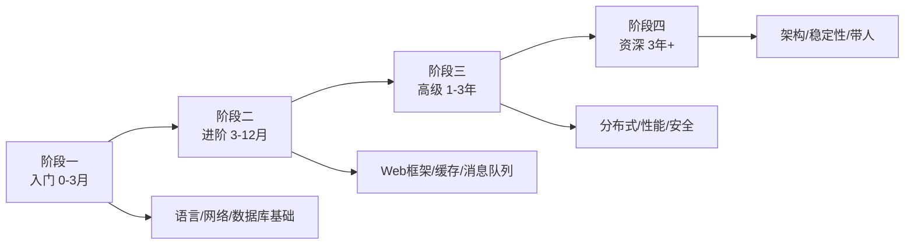

# 后端工程师学习路线图

> 从「能跑一个接口」到「能扛住百万级 QPS」，分四个阶段。每个节点都写清楚：学什么、学到什么程度算过、常见坑、推荐资源。

---

## 阶段一：入门 0-3 个月（语言与基础）

目标：掌握一门主力语言的语法与常用标准库，理解网络和数据库的基本概念。

- **1. 选一门主力语言** —— 推荐 Python（入门友好）或 Go（云原生岗位多）或 Java（企业级岗位多）。学到什么程度：能写 200 行的命令行小程序。常见坑：三门语言学半门。资源：[廖雪峰 Python 教程](https://www.liaoxuefeng.com/wiki/1016959663602400) / [Go by Example](https://gobyexample.com/)
- **2. 基本数据结构** —— 学什么：数组、链表、哈希表、栈、队列，对应语言里的 List/Dict/Map。学到什么程度：能手写一个链表反转。常见坑：只会调库不知道底层。资源：[visualgo 可视化](https://visualgo.net/zh)
- **3. 函数与模块化** —— 学什么：函数设计、参数传递、包/模块组织、import 机制。学到什么程度：能把一个 500 行脚本拆成 3 个模块。常见坑：所有代码写一个文件。资源：[Python 模块](https://docs.python.org/3/tutorial/modules.html)
- **4. 错误处理** —— 学什么：异常/错误类型、try-catch、错误包装、不要吞错误。学到什么程度：线上出问题时日志里有明确堆栈。常见坑：`catch (e) {}` 吞掉一切。资源：[Go 错误处理](https://go.dev/blog/error-handling-and-go)
- **5. 命令行工具** —— 学什么：`cd/ls/grep/find/ps/kill`、管道、重定向。学到什么程度：能在服务器上用命令排查一个进程占内存。常见坑：只会 Windows 双击。资源：[Linux 命令大全](https://www.runoob.com/linux/linux-command-manual.html)
- **6. HTTP 协议** —— 学什么：请求方法、状态码、Header、Body、Cookie。学到什么程度：能用 curl 完整发一个 POST 请求。常见坑：把 200 当成功（业务错误在 body 里）。资源：[MDN HTTP 概述](https://developer.mozilla.org/zh-CN/docs/Web/HTTP/Guides/Overview)
- **7. TCP/IP 基础** —— 学什么：三次握手、四次挥手、TCP 与 UDP 区别。学到什么程度：能说清为什么三次不是两次。常见坑：以为 TCP 不丢包。资源：[菜鸟 TCP/IP](https://www.runoob.com/note/11293)
- **8. SQL 入门** —— 学什么：SELECT/WHERE/JOIN/GROUP BY/聚合函数。学到什么程度：能写三表关联查询。常见坑：SELECT * 生产环境跑。资源：[SQLBolt 交互教程](https://sqlbolt.com/)
- **9. MySQL 基础** —— 学什么：装一个 MySQL、建库建表、数据类型、主键索引。学到什么程度：能设计一张带外键的用户表。常见坑：用 float 存金额。资源：[MySQL 官方文档](https://dev.mysql.com/doc/)
- **10. RESTful 接口** —— 学什么：资源命名、HTTP 方法语义、状态码约定、JSON 返回结构。学到什么程度：能写一个用户 CRUD 接口。常见坑：URL 里放动词 `/getUserList`。资源：[MDN HTTP 方法](https://developer.mozilla.org/zh-CN/docs/Web/HTTP/Methods)
- **11. 第一个 Web 服务** —— 学什么：Python Flask/FastAPI 或 Go Gin，写一个 Hello World 接口。学到什么程度：浏览器/curl 能访问到。常见坑：跑在 localhost 外面访问不到。资源：[FastAPI 中文](https://fastapi.tiangolo.com/zh/)
- **12. 路由与请求处理** —— 学什么：路径参数、查询参数、请求体解析、响应格式化。学到什么程度：能接一个带 JSON body 的 POST。常见坑：不校验入参。资源：[Flask 文档](https://flask.palletsprojects.com/)
- **13. 中间件概念** —— 学什么：请求日志、CORS、鉴权、异常捕获。学到什么程度：能写一个打印请求耗时的中间件。常见坑：业务逻辑写在中间件里。资源：[Express 中间件](https://expressjs.com/zh-cn/guide/using-middleware.html)
- **14. 环境变量与配置** —— 学什么：不要硬编码数据库密码，用 `.env`。学到什么程度：本地/测试/生产配置隔离。常见坑：把 .env 提交到 Git。资源：[12-Factor 配置](https://12factor.net/zh_cn/config)
- **15. Git 协作** —— 学什么：分支、PR/code review、冲突解决。学到什么程度：能提一个被 review 的 PR。常见坑：一个 PR 改 20 个文件。资源：[Pro Git](https://git-scm.com/book/zh/v2)
- **16. 日志** —— 学什么：结构化日志（JSON）、级别 debug/info/error、不要用 print。学到什么程度：线上一条报错能定位到哪个请求。常见坑：日志里不打 trace_id。资源：[Python logging](https://docs.python.org/3/howto/logging.html)
- **17. 调试** —— 学什么：打断点、看变量、远程调试。学到什么程度：不用 print 也能定位 bug。常见坑：靠加 print 猜。资源：[VS Code 调试](https://code.visualstudio.com/docs/debugtest/debugging)
- **18. 版本与包管理** —— 学什么：Python venv/pip-tools 或 Go modules，依赖锁定。学到什么程度：别人 clone 下来能复现。常见坑：pip install 全局乱装。资源：[pip 文档](https://pip.pypa.io/)
- **19. 前端联调认知** —— 学什么：跨域、字段命名约定、分页格式、错误码。学到什么程度：和前端对齐一份接口文档。常见坑：前后端各说各话。资源：[OpenAPI 规范](https://swagger.io/specification/)
- **20. 第一个接口项目** —— 学什么：用户注册/登录/列表 CRUD，连 MySQL。学到什么程度：能跑在服务器上被别人访问。常见坑：SQL 注入。资源：[FastAPI 教程](https://fastapi.tiangolo.com/zh/tutorial/)

**阶段一过线标准**：独立写出一个带 MySQL 增删改查、有日志、能部署的 Web API 项目。

---

## 阶段二：进阶 3-12 个月（框架、缓存、消息队列）

目标：能扛住真实业务复杂度，理解常用中间件为什么存在。

- **21. Web 框架深入** —— 学什么：FastAPI/Django/Spring Boot 选一，中间件、依赖注入、ORM。学到什么程度：能说清框架一个请求的完整生命周期。常见坑：把框架当银弹。资源：[Django 中文](https://docs.djangoproject.com/zh-hans/)
- **22. ORM** —— 学什么：SQLAlchemy/Prisma/MyBatis，映射、关系、N+1 问题。学到什么程度：能在慢查询日志里发现 N+1。常见坑：ORM 生成的 SQL 没看过。资源：[SQLAlchemy](https://docs.sqlalchemy.org/)
- **23. 索引原理** —— 学什么：B+ 树、聚簇索引、覆盖索引、最左前缀。学到什么程度：能用 EXPLAIN 分析一条慢查询。常见坑：什么字段都加索引。资源：[MySQL 索引优化](https://dev.mysql.com/doc/refman/8.0/en/optimization-indexes.html)
- **24. 事务与隔离级别** —— 学什么：ACID、脏读/幻读、REPEATABLE READ。学到什么程度：能说清转账为什么要事务。常见坑：事务里调 RPC。资源：[MySQL 事务](https://dev.mysql.com/doc/refman/8.0/en/innodb-transaction-model.html)
- **25. Redis 基础** —— 学什么：String/Hash/List/Set/ZSet、过期、持久化。学到什么程度：能用 Redis 做缓存和排行榜。常见坑：把 Redis 当数据库。资源：[Redis 官方文档](https://redis.io/docs/)
- **26. 缓存策略** —— 学什么：Cache-Aside、穿透/击穿/雪崩、布隆过滤器。学到什么程度：能设计一个热点数据缓存方案。常见坑：缓存和数据库不一致。资源：[Redis 缓存模式](https://redis.io/learn/develop/client-patterns/caching)
- **27. 消息队列** —— 学什么：RabbitMQ/Kafka 选一，生产消费、ack、重试。学到什么程度：能把一个发邮件的操作异步化。常见坑：消息丢了不知道。资源：[Kafka 官方](https://kafka.apache.org/documentation/)
- **28. 异步任务** —— 学什么：Celery / Asynq，定时任务、任务状态。学到什么程度：能写一个每天凌晨跑的报表任务。常见坑：任务重复执行。资源：[Celery 文档](https://docs.celeryq.dev/)
- **29. 鉴权 JWT/Session** —— 学什么：Token 结构、刷新机制、服务端 Session 对比。学到什么程度：能说清为什么不能把 JWT 直接吊销。常见坑：JWT 不放过期时间。资源：[JWT 官网](https://jwt.io/introduction)
- **30. 接口安全** —— 学什么：HTTPS、参数校验、防重放、限流。学到什么程度：能挡住简单的刷接口。常见坑：不校验入参类型。资源：[OWASP API 安全](https://owasp.org/API-Security/)
- **31. 配置中心** —— 学什么：环境隔离、动态配置、敏感信息加密。学到什么程度：改配置不用重启服务。常见坑：配置散在代码里。资源：[Spring Cloud Config](https://spring.io/projects/spring-cloud-config)
- **32. API 文档** —— 学什么：OpenAPI/Swagger 自动生成。学到什么程度：前端打开链接就能联调。常见坑：文档和代码不一致。资源：[Swagger Editor](https://editor.swagger.io/)
- **33. Docker 入门** —— 学什么：镜像、容器、Dockerfile、docker-compose。学到什么程度：能把自己的服务打包成镜像跑起来。常见坑：镜像打了几百 MB。资源：[Docker 官方教程](https://docs.docker.com/get-started/)
- **34. 环境一致性** —— 学什么：本地/测试/生产依赖一致，"我本地能跑"。学到什么程度：新人 clone 下来一条命令起服务。常见坑：不同环境装不同版本。资源：[Docker Compose](https://docs.docker.com/compose/)
- **35. 单元测试** —— 学什么：pytest/JUnit，mock、测试用例设计。学到什么程度：核心业务逻辑有测试。常见坑：测试连真数据库。资源：[pytest 文档](https://docs.pytest.org/)
- **36. 集成测试** —— 学什么：起测试数据库、测接口、断言。学到什么程度：CI 里能跑。常见坑：测试用例互相依赖。资源：[FastAPI 测试](https://fastapi.tiangolo.com/zh/tutorial/testing/)
- **37. SQL 进阶** —— 学什么：子查询、窗口函数、执行计划分析。学到什么程度：能写一个月度留存统计 SQL。常见坑：SELECT DISTINCT 去重。资源：[PostgreSQL 窗口函数](https://www.postgresql.org/docs/current/tutorial-window.html)
- **38. 数据库设计** —— 学什么：范式、反范式、表关系、索引设计。学到什么程度：能设计一个电商订单表。常见坑：一张表 50 个字段。资源：[数据库设计范式](https://www.runoob.com/db/db-database-design.html)
- **39. 接口性能初步** —— 学什么：慢查询定位、连接池、N+1 消灭。学到什么程度：一个 5 秒接口优化到 200ms。常见坑：在循环里查数据库。资源：[MySQL 慢查询日志](https://dev.mysql.com/doc/refman/8.0/en/slow-query-log.html)
- **40. 错误码与异常体系** —— 学什么：统一返回结构、错误码分段、业务异常 vs 系统异常。学到什么程度：前端能根据错误码做提示。常见坑：所有错误都返回 500。资源：[REST 错误模型](https://robwold.github.io/rest-error-model/)
- **41. 文件存储** —— 学什么：本地磁盘 vs 对象存储 S3/OSS，上传下载、预签名 URL。学到什么程度：能做一个头像上传接口。常见坑：把文件存数据库 BLOB。资源：[MinIO 文档](https://min.io/docs/minio/linux/index.html)
- **42. 定时任务** —— 学什么：crontab、分布式锁防多实例重复执行。学到什么程度：多实例部署任务不重复跑。常见坑：单机 crontab 上多机就崩。资源：[celery beat](https://docs.celeryq.dev/en/stable/userguide/periodic-tasks.html)

**阶段二过线标准**：用框架 + MySQL + Redis + MQ 做一个有缓存、有异步任务、有测试的真实业务后端。

---

## 阶段三：高级 1-3 年（分布式、性能、稳定性）

目标：能对系统的容量和稳定性负责，能做技术方案设计。

- **43. 分布式系统概念** —— 学什么：CAP、最终一致性、幂等。学到什么程度：能说清为什么分布式事务难。常见坑：以为分布式就是多部署几个实例。资源：[Designing Data-Intensive Applications](https://dataintensive.net/)
- **44. 缓存一致性** —— 学什么：双写策略、延迟双删、旁路缓存。学到什么程度：能说清删缓存还是更缓存。常见坑：先更新库再删缓存 yet 不一致。资源：[缓存模式](https://martinfowler.com/bliki/TwoHardThings.html)
- **45. 消息队列深入** —— 学什么：顺序消费、死信队列、Exactly-Once 语义、积压处理。学到什么程度：能处理一次线上消息积压。常见坑：不消费死信。资源：[Kafka 一致性](https://docs.confluent.io/platform/current/kafka/introduction.html)
- **46. 分库分表** —— 学什么：水平拆分、分片键、扩容。学到什么程度：能评估什么时候要分表。常见坑：提前分表过度设计。资源：[ShardingSphere](https://shardingsphere.apache.org/document/current/cn/overview/)
- **47. 读写分离** —— 学什么：主从同步、读走从库、主从延迟。学到什么程度：能说清为什么刚写完查不到。常见坑：强一致性读也走从库。资源：[MySQL 主从复制](https://dev.mysql.com/doc/refman/8.0/en/replication.html)
- **48. 接口限流** —— 学什么：令牌桶/漏桶、单机 vs 分布式限流。学到什么程度：能写一个限流中间件。常见坑：限流阈值拍脑袋。资源：[Sentinel 文档](https://sentinelguard.io/zh-cn/)
- **49. 熔断降级** —— 学什么：Resilience4j/Hystrix，失败率统计、熔断半开。学到什么程度：下游挂了不拖垮自己。常见坑：熔断了没有降级兜底。资源：[Resilience4j](https://resilience4j.readme.io/)
- **50. 服务拆分** —— 学什么：单体 vs 微服务、边界上下文、什么时候拆。学到什么程度：能写一页拆 vs 不拆的论证。常见坑：一上来就全微服务。资源：[Martin Fowler 微服务](https://martinfowler.com/articles/microservices.html)
- **51. 服务间通信** —— 学什么：HTTP/gRPC、序列化、服务发现。学到什么程度：能写一个 gRPC 接口。常见坑：同步调用链太长。资源：[gRPC 官网](https://grpc.io/docs/)
- **52. 链路追踪** —— 学什么：OpenTelemetry、trace_id 全链路串起来。学到什么程度：一个请求跨 3 个服务能在后台看到瀑布。常见坑：日志没有 trace_id。资源：[OpenTelemetry](https://opentelemetry.io/docs/)
- **53. 配置中心与服务治理** —— 学什么：Nacos/Consul，注册发现、健康检查。学到什么程度：一个服务挂了自动摘除。常见坑：注册中心挂了全站挂。资源：[Nacos 中文](https://nacos.io/zh-cn/docs/what-is-nacos.html)
- **54. 可观测性：日志** —— 学什么：ELK/Loki，结构化采集、检索。学到什么程度：能在 1 分钟内搜到一个错误。常见坑：日志没结构化。资源：[Loki 文档](https://grafana.com/oss/loki/)
- **55. 可观测性：指标** —— 学什么：Prometheus + Grafana，RED 指标。学到什么程度：能给一个服务画 QPS/延迟/错误率面板。常见坑：只看 CPU。资源：[Prometheus 文档](https://prometheus.io/docs/introduction/overview/)
- **56. 数据库选型** —— 学什么：MySQL vs PostgreSQL vs MongoDB vs ClickHouse 取舍。学到什么程度：能给一个报表需求选对库。常见坑：什么都用 MySQL。资源：[PostgreSQL 文档](https://www.postgresql.org/docs/)
- **57. 搜索引擎** —— 学什么：Elasticsearch 基础、倒排索引、什么时候用。学到什么程度：能做一个文章全文搜索。常见坑：用 ES 当主库。资源：[ES 中文](https://www.elastic.co/guide/cn/elasticsearch/guide/current/index.html)
- **58. 分布式锁** —— 学什么：Redis SET NX、Redisson、锁过期与续期。学到什么程度：能说清 Redlock 争议。常见坑：锁忘了释放。资源：[Redis 分布式锁](https://redis.io/learn/develop/client-patterns/distributed-locks)
- **59. 分布式事务** —— 学什么：TCC、本地消息表、最大努力通知。学到什么程度：能给一个转账场景选方案。常见坑：强上 2PC。资源：[Seata 中文](https://seata.io/zh-cn/docs/overview.html)
- **60. 压测** —— 学什么：wrk/locust/JMeter，找到性能拐点。学到什么程度：能说出自己服务的 QPS 上限。常见坑：单机压测得出线上结论。资源：[wrk 文档](https://github.com/wg/wrk)
- **61. 安全：SQL 注入/XSS** —— 学什么：预编译、参数化、输入校验。学到什么程度：能说清为什么拼接 SQL 危险。常见坑：ORM 就不注入。资源：[OWASP SQL 注入](https://cheatsheets.owasp.org/cheatsheets/SQL_Injection_Prevention_Cheat_Sheet.html)
- **62. 备份与恢复** —— 学什么：全量+增量备份、演练恢复。学到什么程度：敢说"库删了能找回"。常见坑：只备份不演练恢复。资源：[MySQL 备份](https://dev.mysql.com/doc/refman/8.0/en/backup-and-recovery.html)

**阶段三过线标准**：主导过一次容量评估和性能优化，写过一份技术方案并评审通过。

---

## 阶段四：资深 3 年+（架构、稳定性、带人）

目标：从写接口的人变成设计系统的人。

- **63. 架构设计文档** —— 学什么：画架构图、写 ADR、权衡记录。学到什么程度：半年后有人能看懂你为什么这么选。常见坑：图好看没有取舍。资源：[C4 模型](https://c4model.com/)
- **64. 容量规划** —— 学什么：QPS 估算、磁盘带宽内存、成本。学到什么程度：能说清大促要加几台机器。常见坑：按峰值不加冗余。资源：[Google SRE 书籍](https://sre.google/sre-book/table-of-contents/)
- **65. 稳定性体系** —— 学什么：SLO/SLI、错误预算、值班机制。学到什么程度：能给团队定一个合理的 SLO。常见坑：SLO 定 99.99% 不现实。资源：[Google SRE 服务层级](https://sre.google/sre-book/service-level-objectives/)
- **66. 故障演练** —— 学什么：混沌工程、故障注入、复盘。学到什么程度：主动杀一个实例不慌。常见坑：只演练不改进。资源：[Chaos Engineering](https://principlesofchaos.org/zh/)
- **67. 技术选型决策** —— 学什么：不追新、看社区健康度、运维成本。学到什么程度：能写一页"为什么选 X 不选 Y"。常见坑：因为熟悉就选。资源：[ThoughtWorks 技术雷达](https://www.thoughtworks.com/radar)
- **68. Code Review 深入** —— 学什么：不仅看代码，看设计、看测试、看可维护性。学到什么程度：一次 review 能教会一个人。常见坑：只挑格式。资源：[Google CR 指南](https://google.github.io/eng-practices/review/)
- **69. 带人与导师制** —— 学什么：1on1、给反馈、安排成长任务。学到什么程度：手下的人半年后能独立扛模块。常见坑：什么都自己写。资源：[Staff Engineer](https://staff-engineering.com/)
- **70. 技术影响力** —— 学什么：内部分享、写文档、开源。学到什么程度：别的团队遇到问题会来找你。常见坑：闷头写代码不沟通。资源：[开源指南](https://opensource.guide/zh/)
- **71. 缓存一致性深水区** —— 学什么：延迟双删、binlog 订阅失效。学到什么程度：能设计一个最终一致的缓存方案。常见坑：删缓存时机不对。资源：[Cache Aside](https://learn.microsoft.com/azure/architecture/patterns/cache-aside)
- **72. 数据库慢查询治理** —— 学什么：慢日志、profile、锁等待。学到什么程度：能把一个 10 秒 SQL 优化到 100ms。常见坑：加索引不加 where。资源：[MySQL EXPLAIN](https://dev.mysql.com/doc/refman/8.0/en/explain.html)
- **73. API 版本演进** —— 学什么：向后兼容、废弃策略。学到什么程度：老客户端不死。常见坑：改字段不通知。资源：[API 版本指南](https://stripe.com/blog/api-versioning)
- **74. 任务幂等性** —— 学什么：幂等 key、去重表。学到什么程度：重试不重复扣款。常见坑：付款接口不幂等。资源：[幂等设计](https://restfulapi.net/idempotent-rest-apis/)
- **75. 数据归档** —— 学什么：冷热分离、历史表。学到什么程度：主表不膨胀。常见坑：5 年数据都在一张表。资源：[MySQL 分区](https://dev.mysql.com/doc/refman/8.0/en/partitioning.html)
- **76. 灰度发布后端** —— 学什么：按请求头/用户 ID 路由到新版本。学到什么程度：1% 流量切新代码。常见坑：直接全量。资源：[Nginx 灰度](https://docs.nginx.com/nginx/admin-guide/load-balancer/use-weighted-load-balancing/)
- **77. 压测与容量** —— 学什么：找到拐点、留冗余。学到什么程度：能说出系统峰值 QPS。常见坑：压测脚本不真实。资源：[wrk2](https://github.com/giltene/wrk2)
- **78. 安全审计** —— 学什么：依赖漏洞、敏感日志、越权。学到什么程度：能过一次安全扫描。常见坑：日志里打密码。资源：[OWASP Dependency Check](https://owasp.org/www-project-dependency-check/)
- **79. 数据迁移** —— 学什么：双写、影子表、回切。学到什么程度：大表迁移不停机。常见坑：直接 rename 表。资源：[零停机迁移](https://github.com/postgres/dsl)
- **80. 技术债决策** —— 学什么：什么时候重写、什么时候忍。学到什么程度：能算清重写的 ROI。常见坑：一不爽就重写。资源：[When to Rewrite](https://www.joelonsoftware.com/2000/04/06/things-you-should-never-do-part-i/)

**阶段四过线标准**：负责过一个核心系统的架构演进，有可量化的稳定性提升（如 P0 事故下降）。

---

## 学习资源清单

- [廖雪峰 Python 教程](https://www.liaoxuefeng.com/wiki/1016959663602400) —— Python 入门
- [FastAPI 中文文档](https://fastapi.tiangolo.com/zh/) —— 现代 Python Web 框架
- [MySQL 官方文档](https://dev.mysql.com/doc/) / [Redis 官方文档](https://redis.io/docs/)
- [Kafka 官方](https://kafka.apache.org/documentation/) / [Docker 官方](https://docs.docker.com/get-started/)
- [Designing Data-Intensive Applications](https://dataintensive.net/) —— 分布式必读
- [Google SRE Book](https://sre.google/sre-book/table-of-contents/) —— 稳定性圣经
- [SQLBolt](https://sqlbolt.com/) —— SQL 交互式入门

## 常见坑（提前说）

1. **只学框架不学原理**：换个框架就不会了。
2. **不练数据库**：后端一半问题在 SQL 和索引。
3. **不写测试**：上线靠祈祷。
4. **跳过业务谈架构**：脱离业务的架构都是炫技。
