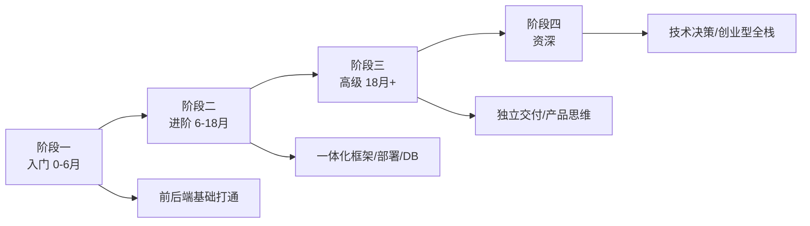

# 全栈工程师学习路线图

> 不是「前端会一点 + 后端会一点」，而是「一个人能从数据库到用户界面把产品做出来」。分四个阶段。

---

## 阶段一：入门 0-6 个月（前后端基础打通）

目标：会做一个能跑的完整小产品，理解数据从浏览器到数据库再回来的完整链路。

- **1. HTML/CSS/JS 三基础** —— 学什么：参考[前端路线图阶段一](./01-frontend.md)的 1-16 节点。学到什么程度：不写框架也能做静态页。常见坑：跳过基础直接上框架。资源：[MDN](https://developer.mozilla.org/zh-CN/docs/Learn_web_development/Getting_started)
- **2. 一门后端语言** —— 推荐 Node.js（前后端同语言，全栈最快路径）或 Python。学到什么程度：能写一个接口。常见坑：又想 Node 又想 Go。资源：[Node.js 中文](https://nodejs.org/zh-cn/docs/guides/)
- **3. Node.js 运行时** —— 学什么：事件循环、模块系统、npm。学到什么程度：能写 Express/Fastify 接口。常见坑：把 Node 当浏览器写。资源：[Node.js 文档](https://nodejs.org/zh-cn/docs/guides/)
- **4. Express/Fastify** —— 学什么：路由、中间件、请求响应。学到什么程度：写一个 CRUD API。常见坑：业务逻辑全堆在路由里。资源：[Express 中文](https://expressjs.com/zh-cn/)
- **5. SQL 与 SQLite/PostgreSQL** —— 学什么：建表、查询、JOIN。学到什么程度：能存一个待办清单。常见坑：用 MongoDB 当入门库。资源：[PostgreSQL 教程](https://www.postgresql.org/docs/current/tutorial.html)
- **6. 浏览器到服务器全链路** —— 学什么：一个 fetch 请求从前端发出，经过路由、控制器、数据库，再返回 JSON 渲染到页面。学到什么程度：能画出这个链路图。常见坑：不知道数据是怎么回来的。资源：[MDN 第一份 API](https://developer.mozilla.org/zh-CN/docs/Learn_web_development/Howto/Serve_website_files)
- **7. REST 接口设计** —— 学什么：资源命名、状态码、JSON 结构。学到什么程度：能和自己前端对接口。常见坑：URL 放动词。资源：[MDN HTTP](https://developer.mozilla.org/zh-CN/docs/Web/HTTP/Guides/Overview)
- **8. 表单提交与渲染** —— 学什么：前端收集数据→POST→入库→列表渲染。学到什么程度：做一个留言板。常见坑：不防 XSS。资源：[MDN 表单](https://developer.mozilla.org/zh-CN/docs/Learn_web_development/Extensions/Forms)
- **9. 认证基础** —— 学什么：Session/Cookie、登录态。学到什么程度：能做一个简单登录。常见坑：密码明文存。资源：[MDN 认证](https://developer.mozilla.org/zh-CN/docs/Web/HTTP/Guides/Authentication)
- **10. 密码哈希** —— 学什么：bcrypt/argon2，绝不存明文。学到什么程度：能说清为什么不能自己加密。常见坑：用 MD5。资源：[bcrypt](https://en.wikipedia.org/wiki/Bcrypt)
- **11. Git 全流程** —— 学什么：clone/commit/push/PR。学到什么程度：代码在 GitHub 上。常见坑：本地改了不 push。资源：[Pro Git](https://git-scm.com/book/zh/v2)
- **12. 命令行与 SSH** —— 学什么：ssh 登录服务器、scp 传文件、基础 Linux。学到什么程度：能登录一台云服务器。常见坑：在 Windows 上点来点去。资源：[Linux 命令](https://www.runoob.com/linux/linux-command-manual.html)
- **13. 第一个全栈项目** —— 学什么：留言板 / 待办 / 短链接，前后端 + 数据库。学到什么程度：部署上线给朋友用。常见坑：做完不部署。资源：[Render 部署](https://render.com/docs)
- **14. 调试全链路** —— 学什么：前端 DevTools + 后端日志 + 数据库直接查。学到什么程度：一个 bug 从前端追到库。常见坑：只看前端 Network。资源：[Chrome DevTools](https://developer.chrome.com/docs/devtools)
- **15. 环境变量** —— 学什么：数据库密码不写死。学到什么程度：本地和线上配置分离。常见坑：.env 提交 Git。资源：[12-Factor 配置](https://12factor.net/zh_cn/config)

**阶段一过线标准**：一个人独立做出一个有登录、有数据库、能公网访问的小产品。

---

## 阶段二：进阶 6-18 个月（一体化框架、部署、工程化）

目标：能用现代全栈框架快速交付，理解前后端分离/一体的取舍。

- **16. 选一个全栈框架** —— Next.js（React）或 Nuxt（Vue）或 SvelteKit。学到什么程度：能写一个全栈页面。常见坑：三个都学。资源：[Next.js 文档](https://nextjs.org/docs)
- **17. API Routes / Server Actions** —— 学什么：在同构框架里写后端逻辑。学到什么程度：能在一个文件里写前后端。常见坑：把数据库调用放客户端组件。资源：[Next.js Server Actions](https://nextjs.org/docs/app/building-your-application/data-fetching/server-actions)
- **18. 数据库 ORM** —— 学什么：Prisma/Drizzle，schema 定义、迁移。学到什么程度：改表自动生成迁移。常见坑：手写 SQL 迁移。资源：[Prisma 文档](https://www.prisma.io/docs)
- **19. Supabase/PocketBase** —— 学什么：托管后端，开箱即用 Auth/DB/Storage。学到什么程度：周末做 demo 不用自己写后端。常见坑：生产也用免费额度。资源：[Supabase](https://supabase.com/docs)
- **20. 部署：Vercel/Netlify** —— 学什么：push 代码自动部署。学到什么程度：推 main 就上线。常见坑：数据库连接池爆了。资源：[Vercel 文档](https://vercel.com/docs)
- **21. 部署：VPS/Docker** —— 学什么：一台云服务器、Docker Compose 起全栈服务。学到什么程度：自己买的 VPS 上跑着自己的站。常见坑：用 root 跑应用。资源：[Docker Compose](https://docs.docker.com/compose/)
- **22. 域名与 HTTPS** —— 学什么：买域名、DNS 解析、Nginx 反代、Let's Encrypt 证书。学到什么程度：自己的站有 https。常见坑：证书忘了续期。资源：[Nginx](https://nginx.org/en/docs/)
- **23. CSS 框架** —— Tailwind 或 UnoCSS。学到什么程度：不写原生 CSS 也能做漂亮界面。常见坑：Tailwind 类名堆 200 个。资源：[Tailwind](https://www.tailwindcss.cn/docs)
- **24. 状态管理** —— 学什么：服务端状态用 TanStack Query，客户端状态用 Zustand。学到什么程度：不用自己写 loading/error。常见坑：所有数据都塞 Redux。资源：[TanStack Query](https://tanstack.com/query/latest)
- **25. 表单与校验** —— React Hook Form + Zod。学到什么程度：前后端共用一套 schema。常见坑：前后端各写一套校验。资源：[Zod](https://zod.dev/)
- **26. 认证一体化** —— NextAuth/Auth.js。学到什么程度：能接 GitHub/Google 登录。常见坑：自己造轮子做 OAuth。资源：[Auth.js](https://authjs.dev/)
- **27. 文件上传与存储** —— S3/OSS 直传。学到什么程度：大文件不经过自己服务器。常见坑：文件存服务器磁盘。资源：[AWS S3](https://docs.aws.amazon.com/s3/)
- **28. 邮件发送** —— Resend/SendGrid，注册验证邮件。学到什么程度：能发一封带链接的验证邮件。常见坑：用自己邮箱 SMTP 进垃圾箱。资源：[Resend](https://resend.com/docs)
- **29. 支付入门** —— 学什么：Stripe 支付流、webhook。学到什么程度：能收一笔测试款。常见坑：webhook 不验签。资源：[Stripe](https://docs.stripe.com/)
- **30. 后台管理** —— 学什么：AdminJS/Refine，快速搭管理后台。学到什么程度：能看用户和订单。常见坑：给业务方做后台用前端框架从零写。资源：[Refine](https://refine.dev/)
- **31. 错误监控** —— Sentry 前后端一起接。学到什么程度：用户报错你手机收到。常见坑：只接前端。资源：[Sentry](https://docs.sentry.io/)
- **32. 分析与埋点** —— Plausible/Umami 自助分析。学到什么程度：能看每天多少人访问。常见坑：直接上 GA。资源：[Umami](https://umami.is/docs)
- **33. 测试金字塔** —— 单元 + 接口 + E2E（Playwright）。学到什么程度：核心流程有 E2E。常见坑：只测后端接口。资源：[Playwright](https://playwright.dev/docs/intro)
- **34. CI/CD** —— GitHub Actions，push 跑测试 + 部署。学到什么程度：合并 PR 自动上线。常见坑：CI 红了还合并。资源：[GitHub Actions](https://docs.github.com/zh/actions)
- **35. 性能预算** —— 首屏大小、LCP。学到什么程度：bundle 超过预算有提醒。常见坑：随便加 npm 包。资源：[Bundlephobia](https://bundlephobia.com/)
- **36. 环境管理** —— 开发/预发/生产三套。学到什么程度：预发验证完再上生产。常见坑：直接在生产改。资源：[12-Factor](https://12factor.net/zh_cn/)

**阶段二过线标准**：用 Next.js/Nuxt + Prisma + Vercel 做出一个有真实用户的小产品（哪怕 50 个）。

---

## 阶段三：高级 18 个月+（独立交付、产品思维）

目标：能独立把一个想法做成产品并上线，对业务结果负责。

- **37. 需求拆解** —— 学什么：把一个模糊想法拆成可执行任务。学到什么程度：一周内能出 MVP。常见坑：一上来想做全功能。资源：[Running Lean](https://leanstack.com/running-lean-book/)
- **38. 数据库设计进阶** —— 学什么：范式 vs 反范式、索引、迁移策略。学到什么程度：线上加字段不锁表。常见坑：大表直接 ALTER。资源：[Prisma Migrate](https://www.prisma.io/docs/orm/prisma-migrate)
- **39. 缓存策略** —— 学什么：Redis 缓存、页面缓存、CDN。学到什么程度：一个热门页不打数据库。常见坑：缓存 key 设计混乱。资源：[Redis](https://redis.io/docs/)
- **40. 异步任务** —— 学什么：队列、定时任务、失败重试。学到什么程度：发邮件/报表不阻塞请求。常见坑：请求里同步调第三方。资源：[BullMQ](https://docs.bullmq.io/)
- **41. WebSocket 实时** —— 学什么：聊天、通知、实时更新。学到什么程度：能做一个实时在线列表。常见坑：不用心跳。资源：[Socket.IO](https://socket.io/zh-CN/docs/v4/)
- **42. 搜索** —— 学什么：PostgreSQL 全文或 Meilisearch。学到什么程度：能做一个站内搜索。常见坑：LIKE '%xx%'。资源：[Meilisearch](https://www.meilisearch.com/docs)
- **43. 多租户** —— 学什么：一个系统服务多个客户，数据隔离。学到什么程度：能说清共享库 vs 独立库。常见坑：忘了加 tenant_id 过滤。资源：[Supabase RLS](https://docs.supabase.com/guides/auth/row-level-security)
- **44. 权限模型** —— 学什么：RBAC、行级权限。学到什么程度：普通用户不能看管理员数据。常见坑：前端藏按钮后端不校验。资源：[CASL](https://casl.js.org/)
- **45. 国际化 i18n** —— 学什么：文案抽离、日期货币格式。学到什么程度：能切中英文。常见坑：文案硬编码。资源：[next-intl](https://next-intl.dev/)
- **46. 可访问性与 SEO** —— 学什么：meta 标签、SSR、语义化。学到什么程度：Google 能搜到你的站。常见坑：纯 CSR 没 SEO。资源：[web.dev SEO](https://web.dev/learn/seo)
- **47. 安全基线** —— 学什么：HTTPS、安全 Header、依赖扫描、注入防护。学到什么程度：Lighthouse 安全分满分。常见坑：不跑 npm audit。资源：[OWASP Top 10](https://owasp.org/www-project-top-ten/)
- **48. 备份与恢复** —— 学什么：数据库自动备份、定期恢复演练。学到什么程度：敢删库跑路。常见坑：只备份不演练。资源：[pg_dump](https://www.postgresql.org/docs/current/app-pgdump.html)
- **49. 成本意识** —— 学什么：云服务器/数据库/CDN 费用，哪里贵。学到什么程度：能把月费从 500 砍到 100。常见坑：起步就上顶配。资源：[AWS 定价](https://aws.amazon.com/cn/pricing/)
- **50. 监控告警** —— 学什么：错误率、延迟、磁盘，出问题主动告警。学到什么程度：你比用户先知道挂了。常见坑：告警太敏感没人看。资源：[Better Stack](https://betterstack.com/docs/)
- **51. API 设计品味** —— 学什么：简单、一致、可演进。学到什么程度：别人接你的接口不骂街。常见坑：过度设计。资源：[DHH](https://world.hey.com/dhh)
- **52. 技术写作** —— 学什么：给用户写文档、写 changelog。学到什么程度：用户看文档能自助。常见坑：做完不写文档。资源：[Diataxis](https://diataxis.fr/)
- **53. 从用户反馈迭代** —— 学什么：看数据、听反馈、小步快跑。学到什么程度：每周有一个可上线的改进。常见坑：闭门造车。资源：[Continuous Delivery](https://continuousdelivery.com/)
- **54. 移动端适配/PWA** —— 学什么：手机能用、能加到主屏。学到什么程度：手机浏览器访问不别扭。常见坑：只测桌面。资源：[MDN PWA](https://developer.mozilla.org/zh-CN/docs/Web/Progressive_web_apps)

**阶段三过线标准**：一个人从想法到上线交付一个有真实用户、有收入或真实使用的产品。

---

## 阶段四：资深全栈（技术决策与创业型交付）

- **55. 技术栈取舍** —— 学什么：什么时候用托管后端、什么时候自建。学到什么程度：能根据团队和预算选方案。常见坑：什么都自己造。资源：[ThoughtWorks 雷达](https://www.thoughtworks.com/radar)
- **56. 系统演进** —— 学什么：从单体到模块化、再到拆分。学到什么程度：能说清什么时候必须拆。常见坑：过早微服务。资源：[Monolith First](https://martinfowler.com/bliki/MonolithFirst.html)
- **57. 数据与分析** —— 学什么：事件埋点、漏斗、留存。学到什么程度：能回答用户从哪来、为什么走。常见坑：不埋点凭感觉。资源：[PostHog](https://posthog.com/docs)
- **58. 团队协作** —— 学什么：和设计师/产品/其他工程师协作。学到什么程度：能当技术接口人。常见坑：只写代码不沟通。资源：[RFC](https://github.com/rust-lang/rfcs)
- **59. 招聘与面试** —— 学什么：能面全栈候选人。学到什么程度：知道一个全栈该问什么。常见坑：用后端标准面前端。资源：[Frontend Bookmarks](https://github.com/dypsilon/frontend-dev-bookmarks)
- **60. 长期维护** —— 学什么：依赖升级、技术债、文档。学到什么程度：半年不碰回来还能改。常见坑：项目上线即弃坑。资源：[Sustainable OSS](https://sustainableoss.com/)
- **61. 邮件与通知** —— 学什么：事务邮件、站内信、推送。学到什么程度：用户行为有通知不打扰。常见坑：邮件进垃圾箱。资源：[Postmark](https://postmarkapp.com/guides)
- **62. 国际化 i18n 实战** —— 学什么：中英文切换、日期货币。学到什么程度：产品能出海。常见坑：文案硬编码。资源：[next-intl](https://next-intl.dev/)
- **63. 移动端 H5 深度** —— 学什么：微信 JS-SDK、分享。学到什么程度：能做一个微信内可用的 H5。常见坑：iOS 兼容。资源：[微信 JS-SDK](https://developers.weixin.qq.com/doc/offiaccount/OA_Web_Apps/JS-SDK.html)
- **64. 性能优化闭环** —— 学什么：首屏、包大小、图片。学到什么程度：Lighthouse 90+。常见坑：优化完不回归。资源：[web.dev](https://web.dev/)
- **65. 数据隐私合规** —— 学什么：Cookie 同意、数据删除、隐私政策。学到什么程度：基本合规不被投诉。常见坑：上来就埋点。资源：[GDPR](https://gdpr-info.eu/)
- **66. 自动化备份** —— 学什么：数据库每日备份、异地。学到什么程度：库删了能找回。常见坑：备份脚本从来没成功过。资源：[pg_dump](https://www.postgresql.org/docs/current/app-pgdump.html)
- **67. 多环境配置** —— 学什么：dev/staging/prod。学到什么程度：预发验证再上生产。常见坑：直接改生产。资源：[12-Factor](https://12factor.net/zh_cn/)
- **68. 用户反馈闭环** —— 学什么：收集、分类、修复。学到什么程度：用户感觉被听见。常见坑：反馈石沉大海。资源：[Canny](https://canny.io/)

**阶段四过线标准**：作为技术合伙人/独立开发者，长期维护一个产品 1 年以上。

---

## 学习资源清单

- [Next.js 文档](https://nextjs.org/docs) / [Nuxt 中文](https://nuxt.com.cn/docs)
- [Prisma 文档](https://www.prisma.io/docs) / [Supabase](https://supabase.com/docs)
- [MDN Web Docs](https://developer.mozilla.org/zh-CN/)
- [Vercel 部署](https://vercel.com/docs) / [Docker](https://docs.docker.com/get-started/)
- [Full Stack Open](https://www.fullstackopen.com/en/) —— 赫尔辛基大学免费全栈课

## 常见坑

1. **样样通样样松**：全栈不是浅，是能闭环。
2. **过早优化**：MVP 阶段别上微服务。
3. **不部署**：写在本地的代码不是产品。
4. **忽视产品**：全栈最终拼的是对用户的理解，不是技术广度。
