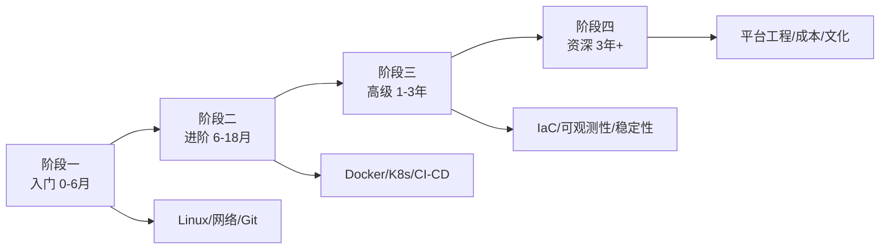

# DevOps 工程师学习路线图

> 从「会用 Linux」到「能让一套系统自动发布、出问题自动告警」，分四个阶段。

---

## 阶段一：入门 0-6 个月（Linux、网络、脚本）

目标：能在 Linux 服务器上独立干活，理解一台服务器从开机到跑服务发生了什么。

- **1. Linux 安装与桌面** —— 学什么：装一个 Ubuntu/Debian 虚拟机或 WSL2。学到什么程度：日常开发在 Linux 里。常见坑：只看教程不实际装。资源：[Ubuntu 下载](https://ubuntu.com/download/desktop)
- **2. 文件系统** —— 学什么：`/etc /var /home /opt` 结构、权限 rwx、属主属组。学到什么程度：能说清一个 755 权限是什么意思。常见坑：chmod 777 解决一切。资源：[Linux 权限](https://www.runoob.com/linux/linux-file-permission.html)
- **3. 常用命令** —— 学什么：`ls/cd/cp/mv/rm/find/grep/ps/top/df/du/tail`。学到什么程度：不查文档能在服务器上找日志。常见坑：会用但不熟。资源：[Linux 命令大全](https://www.runoob.com/linux/linux-command-manual.html)
- **4. 文本处理三剑客** —— 学什么：grep/sed/awk 基础。学到什么程度：能 awk 统计一个日志里每个 IP 出现次数。常见坑：用 Excel 处理服务器日志。资源：[awk 教程](https://www.runoob.com/shell/shell-awk.html)
- **5. Shell 脚本** —— 学什么：变量、循环、条件、函数、`$?` `$1`。学到什么程度：能写一个备份脚本。常见坑：脚本不报错处理。资源：[Bash 教程](https://www.runoob.com/linux/linux-shell.html)
- **6. SSH** —— 学什么：密钥登录、`~/.ssh/config`、跳板机。学到什么程度：不用密码也能登录。常见坑：密码登录公网暴露。资源：[SSH Academy](https://www.ssh.com/academy/ssh)
- **7. 包管理** —— 学什么：apt/dnf/yum、软件源。学到什么程度：能装/删/查软件。常见坑：随便加第三方源。资源：[Debian 软件包](https://www.debian.org/doc/manuals/debian-faq/pkg-basics.zh-cn.html)
- **8. 进程管理** —— 学什么：systemd、service、journalctl。学到什么程度：能让一个服务开机自启。常见坑：nohup 跑服务。资源：[systemd](https://systemd.io/)
- **9. 网络基础** —— 学什么：IP、子网、网关、DNS、端口。学到什么程度：能说清浏览器输入 URL 后发生什么。常见坑：分不清公网私网 IP。资源：[菜鸟 TCP/IP](https://www.runoob.com/note/11293)
- **10. 网络排查命令** —— 学什么：`ping/telnet/ss/curl/dig/tcpdump`。学到什么程度：能判断是 DNS 不通还是端口不通。常见坑：只会 ping。资源：[tcpdump](https://www.tcpdump.org/)
- **11. HTTP 与 Nginx** —— 学什么：Nginx 反代、静态文件、location。学到什么程度：能配一个反代到本地 3000 端口。常见坑：忘了 reload。资源：[Nginx 中文站](https://www.nginx.cn/doc/)
- **12. 防火墙** —— 学什么：ufw/firewalld、端口放行。学到什么程度：只开需要的端口。常见坑：firewall 全关。资源：[Ubuntu UFW](https://ubuntu.com/server/docs/firewalls)
- **13. Git 进阶** —— 学什么：rebase、cherry-pick、tag、`.gitignore`。学到什么程度：能把乱历史整理干净。常见坑：force push 主干。资源：[Pro Git](https://git-scm.com/book/zh/v2)
- **14. Python/Go 脚本** —— 学什么：写自动化脚本处理文件/调 API。学到什么程度：能写脚本批量改 100 台服务器配置。常见坑：直接在生产跑没测试。资源：[廖雪峰 Python](https://www.liaoxuefeng.com/wiki/1016959663602400)
- **15. 定时任务 crontab** —— 学什么：分时段表达式、日志。学到什么程度：能写一个每天备份的 cron。常见坑：cron 环境变量不全。资源：[crontab 教程](https://www.runoob.com/linux/linux-comm-crontab.html)
- **16. 日志基础** —— 学什么：rsyslog、journald、日志轮转。学到什么程度：磁盘不会被日志撑爆。常见坑：日志不轮转。资源：[rsyslog](https://www.rsyslog.com/doc/)
- **17. 磁盘与内存** —— 学什么：df/du/free、inode、swap。学到什么程度：能定位磁盘满了是哪个目录。常见坑：只看根目录。资源：[Linux 文件系统](https://www.runoob.com/linux/linux-filesystem.html)
- **18. 编译与安装** —— 学什么：源码编译、PATH 环境变量。学到什么程度：能装一个不在源里的软件。常见坑：装到 /usr/local 忘了 PATH。资源：[Linux 安装软件](https://www.runoob.com/linux/linux-install-software.html)
- **19. 权限与 sudo** —— 学什么：用户组、sudoers、最小权限。学到什么程度：不用 root 跑服务。常见坑：全员 root。资源：[sudo.ws](https://www.sudo.ws/)
- **20. 第一个服务器运维任务** —— 学什么：在一台云服务器上装 Nginx + 部署一个静态站 + 配 HTTPS。学到什么程度：域名访问到你的页。常见坑：安全组没开 443。资源：[Let's Encrypt](https://letsencrypt.org/zh-cn/gettingstarted/)

**阶段一过线标准**：独立在一台 VPS 上从裸系统到跑着一个带 HTTPS 的网站，能排查常见故障。

---

## 阶段二：进阶 6-18 个月（容器、编排、CI/CD）

目标：理解容器为什么改变了部署方式，能搭一套自动化发布流水线。

- **21. 容器是什么** —— 学什么：容器 vs 虚拟机、namespace/cgroup。学到什么程度：能说清 Docker 为什么轻。常见坑：把容器当虚拟机。资源：[Docker 官网](https://www.docker.com/resources/what-container/)
- **22. Dockerfile** —— 学什么：FROM/RUN/COPY/CMD/ENTRYPOINT、多阶段构建。学到什么程度：写出一个 <50MB 的镜像。常见坑：镜像打了 1GB。资源：[Dockerfile 最佳实践](https://docs.docker.com/develop/develop-images/dockerfile_best-practices/)
- **23. Docker Compose** —— 学什么：多容器本地编排、网络、volume。学到什么程度：一条命令起 MySQL+Redis+App。常见坑：容器数据不持久化。资源：[Compose](https://docs.docker.com/compose/)
- **24. 镜像仓库** —— 学什么：Docker Hub / 私有 Harbor、tag 策略。学到什么程度：能 push/pull 自己的镜像。常见坑：用 latest tag 到处飘。资源：[Harbor](https://goharbor.io/docs/)
- **25. 容器网络** —— 学什么：bridge/host、容器间互通。学到什么程度：两个容器能用服务名互访。常见坑：端口冲突。资源：[Docker 网络](https://docs.docker.com/network/)
- **26. Kubernetes 核心概念** —— 学什么：Pod/Deployment/Service/Namespace。学到什么程度：能把一个镜像跑在 K8s 上。常见坑：把 K8s 当单机 Docker。资源：[K8s 中文](https://kubernetes.io/zh-cn/docs/home/)
- **27. K8s 工作负载** —— 学什么：Deployment 滚动更新、ReplicaSet、HPA。学到什么程度：能说清一次发布经历了什么。常见坑：不设资源限制。资源：[Deployment](https://kubernetes.io/zh-cn/docs/concepts/workloads/controllers/deployment/)
- **28. K8s 服务发现** —— 学什么：ClusterIP/NodePort/Ingress。学到什么程度：外部能访问到服务。常见坑：裸用 NodePort。资源：[Ingress](https://kubernetes.io/zh-cn/docs/concepts/services-networking/ingress/)
- **29. 配置与密钥** —— 学什么：ConfigMap/Secret。学到什么程度：配置不进镜像。常见坑：Secret 用明文 etcd。资源：[ConfigMap](https://kubernetes.io/zh-cn/docs/concepts/configuration/configmap/)
- **30. 持久化存储** —— 学什么：PV/PVC/StorageClass。学到什么程度：Pod 重建数据不丢。常见坑：用 emptyDir 存数据库。资源：[PV](https://kubernetes.io/zh-cn/docs/concepts/storage/persistent-volumes/)
- **31. Helm** —— 学什么：chart 模板、values、release。学到什么程度：能把一个应用参数化部署。常见坑：手改模板不维护 values。资源：[Helm](https://helm.sh/zh/docs/)
- **32. CI 概念** —— 学什么：代码提交后自动跑测试/构建。学到什么程度：PR 状态有绿叉。常见坑：CI 从来不绿。资源：[GitHub Actions](https://docs.github.com/zh/actions)
- **33. GitHub Actions** —— 学什么：workflow、job、step、runner。学到什么程度：push 自动构建镜像并推仓库。常见坑：把密钥打日志。资源：[Actions 入门](https://docs.github.com/zh/actions/quickstart)
- **34. CD 自动化部署** —— 学什么：部署到 VPS/服务器集群/K8s。学到什么程度：合并 main 自动上线。常见坑：没有回滚。资源：[Argo CD](https://argo-cd.readthedocs.io/)
- **35. 回滚** —— 学什么：镜像版本化、一键回退上一版。学到什么程度：发布出问题 30 秒内回滚。常见坑：发布才发现没有上一版镜像。资源：[kubectl rollout undo](https://kubernetes.io/zh-cn/docs/reference/kubectl/generated/kubectl_rollout/)
- **36. 多环境** —— 学什么：dev/staging/prod 隔离。学到什么程度：staging 验证完再上 prod。常见坑：staging 永远没人用。资源：[12-Factor 环境](https://12factor.net/zh_cn/dev-prod-parity)
- **37. 制品管理** —— 学什么：构建产物归档、版本可追溯。学到什么程度：线上跑的代码能对应到 commit。常见坑：构建产物不留。资源：[Nexus](https://www.sonatype.com/nexus-repository)
- **38. 测试在 CI 中** —— 学什么：单元/集成/镜像扫描。学到什么程度：坏代码进不了主干。常见坑：CI 只跑 lint。资源：[Trivy](https://trivy.dev/)
- **39. 容器安全扫描** —— 学什么：镜像漏洞扫描、基础镜像选择。学到什么程度：高危漏洞不让上线。常见坑：用 latest 未扫描镜像。资源：[Trivy 扫描](https://trivy.dev/docs/)
- **40. 日志采集** —— 学什么：stdout 采集、Fluent Bit/Filebeat。学到什么程度：所有 Pod 日志汇聚到一处。常见坑：登录 Pod 里看日志。资源：[Fluent Bit](https://docs.fluentbit.io/manual)
- **41. 监控基础** —— 学什么：CPU/内存/磁盘/网络指标。学到什么程度：能看出一台机器忙不忙。常见坑：只看 CPU。资源：[Prometheus](https://prometheus.io/docs/introduction/overview/)
- **42. 告警入门** —— 学什么：Alertmanager、谁接、接什么。学到什么程度：磁盘满了有人被叫醒。常见坑：告警风暴。资源：[Alertmanager](https://prometheus.io/docs/alerting/latest/alertmanager/)

**阶段二过线标准**：有一条从 PR 到自动部署到 K8s/VPS 的流水线，带测试、镜像扫描、回滚。

---

## 阶段三：高级 1-3 年（IaC、可观测性、稳定性）

目标：把服务器和配置都变成代码，对系统的可观测性和稳定性负责。

- **43. 基础设施即代码** —— 学什么：Terraform 写云资源。学到什么程度：一台云服务器用代码创建。常见坑：手动点控制台。资源：[Terraform 教程](https://developer.hashicorp.com/terraform/tutorials)
- **44. Terraform 状态** —— 学什么：state 文件、远程后端、锁。学到什么程度：团队协作不冲突。常见坑：state 本地传着走。资源：[Terraform state](https://developer.hashicorp.com/terraform/language/state)
- **45. 配置管理** —— 学什么：Ansible 批量配置。学到什么程度：100 台服务器装一个软件一条命令。常见坑：手写 SSH 循环。资源：[Ansible](https://docs.ansible.com/ansible/latest/index.html)
- **46. Prometheus 深入** —— 学什么：exporter、promQL、recording rules。学到什么程度：能写出 P99 延迟查询。常见坑：不写 recording rule。资源：[PromQL](https://prometheus.io/docs/prometheus/latest/querying/basics/)
- **47. Grafana 面板** —— 学什么：看板设计、告警面板。学到什么程度：值班看一块屏就知道系统状态。常见坑：面板上百个图没人看。资源：[Grafana 教程](https://grafana.com/tutorials/)
- **48. 日志栈** —— 学什么：Loki/ELK 选型。学到什么程度：一个错误 1 分钟内搜到。常见坑：日志不结构化。资源：[Loki](https://grafana.com/oss/loki/)
- **49. 链路追踪** —— 学什么：OpenTelemetry、Jaeger/Tempo。学到什么程度：跨服务请求能看到瀑布。常见坑：trace 没传过去。资源：[OpenTelemetry](https://opentelemetry.io/docs/)
- **50. SLI/SLO** —— 学什么：可用性、延迟、错误率。学到什么程度：能给一个服务定 SLO。常见坑：SLO 拍脑袋。资源：[Google SRE SLO](https://sre.google/sre-book/service-level-objectives/)
- **51. 错误预算** —— 学什么：99.9% 一年允许宕 52 分钟。学到什么程度：能和业务谈发布节奏。常见坑：预算用完还在发。资源：[SRE 书籍](https://sre.google/sre-book/table-of-contents/)
- **52. 容量规划** —— 学什么：QPS、资源水位、扩容预测。学到什么程度：大促前知道加几台。常见坑：等挂了才加。资源：[Google 容量规划](https://sre.google/sre-book/practical-capacity-planning/)
- **53. 自动扩缩容** —— 学什么：K8s HPA、基于 CPU/自定义指标。学到什么程度：流量上来自动加 Pod。常见坑：扩缩容阈值抖动。资源：[HPA](https://kubernetes.io/zh-cn/docs/tasks/run-application/horizontal-pod-autoscale/)
- **54. 多可用区/高可用** —— 学什么：跨区部署、负载均衡、单点消除。学到什么程度：挂一个机房服务还活着。常见坑：所有组件单副本。资源：[AWS Well-Architected](https://docs.aws.amazon.com/wellarchitected/)
- **55. 数据库运维** —— 学什么：主从、备份、慢查询、连接数。学到什么程度：数据库挂了你能定位。常见坑：数据库不管。资源：[PostgreSQL HA](https://www.postgresql.org/docs/current/high-availability.html)
- **56. 缓存运维** —— 学什么：Redis 持久化、内存淘汰、集群。学到什么程度：缓存雪崩有预案。常见坑：Redis 当 LRU 用。资源：[Redis 运维](https://redis.io/docs/management/)
- **57. 网络策略** —— 学什么：K8s NetworkPolicy、安全组最小化。学到什么程度：Pod 之间默认拒绝。常见坑：全网全开。资源：[NetworkPolicy](https://kubernetes.io/zh-cn/docs/concepts/services-networking/network-policies/)
- **58. 密钥管理** —— 学什么：Vault / 云 KMS，不硬编码。学到什么程度：密钥定期轮换。常见坑：密钥在 Git 里。资源：[Vault](https://developer.hashicorp.com/vault/docs)
- **59. 灰度/金丝雀发布** —— 学什么：先放 1% 流量观察。学到什么程度：新版本出问题只影响 1%。常见坑：全量发布。资源：[Argo Rollouts](https://argoproj.github.io/rollouts/)
- **60. 混沌工程** —— 学什么：主动杀 Pod、断网。学到什么程度：故障来了不慌。常见坑：只演练不改进。资源：[Chaos Mesh](https://chaos-mesh.org/zh-Hans/docs/)
- **61. 故障复盘** —— 学什么：不追责、找系统原因。学到什么程度：每次事故后有改进项。常见坑：复盘成甩锅大会。资源：[Google 复盘](https://sre.google/sre-book/postmortem-culture/)
- **62. 成本优化** —— 学什么：闲置资源、预留实例、Spot。学到什么程度：云账单砍 30%。常见坑：不管成本。资源：[AWS Cost Explorer](https://aws.amazon.com/cn/aws-cost-management/)

**阶段三过线标准**：用 Terraform 管基础设施、有完整监控告警、做过至少一次故障演练和复盘。

---

## 阶段四：资深 3 年+（平台工程、组织能力）

- **63. 平台工程** —— 学什么：给开发者搭自助平台（golden path）。学到什么程度：开发者自己部署不用找你。常见坑：变成新的瓶颈。资源：[Platform Engineering](https://platformengineering.org/)
- **64. 内部开发者平台** —— 学什么：Backstage 之类的门户。学到什么程度：一个入口看所有服务。常见坑：平台做成另一个系统。资源：[Backstage](https://backstage.io/docs/)
- **65. 多集群管理** —— 学什么：多环境/多区域集群联邦。学到什么程度：集群数量增长不崩。常见坑：每加一个业务加一套集群。资源：[Karmada](https://karmada.io/zh-cn/docs/)
- **66. GitOps** —— 学什么：声明式 Git 作为唯一事实源。学到什么程度：线上配置 drift 自动检测。常见坑：线上手动改不进 Git。资源：[Argo CD](https://argo-cd.readthedocs.io/)
- **67. 安全合规** —— 学什么：CIS Benchmark、等保、镜像签名。学到什么程度：过一次安全审计。常见坑：安全是上线前才想。资源：[CIS Benchmarks](https://www.cisecurity.org/cis-benchmarks)
- **68. 组织与文化** —— 学什么：推动 DevOps 文化、打破开发运维墙。学到什么程度：开发自己负责上线。常见坑：DevOps 变成一个团队。资源：[Accelerate](https://galaxy.pingcode.com/book/accelerate.html)
- **69. 技术决策** —— 学什么：选型、迁移、风险评估。学到什么程度：能写"为什么从 A 迁到 B"。常见坑：为了新技术而迁移。资源：[ADR 示例](https://github.com/adr/madr)
- **70. 带人与培养** —— 学什么：给初中级工程师成长路径。学到什么程度：团队有人能接你的班。常见坑：自己当全公司运维。资源：[Staff Engineer](https://staff-engineering.com/)
- **71. 边缘计算/CDN** —— 学什么：Cloudflare Workers、静态资源 CDN。学到什么程度：能把静态站放 CDN。常见坑：源站没缓存头。资源：[Cloudflare Docs](https://developers.cloudflare.com/)
- **72. 数据库高可用** —— 学什么：主从切换、自动 failover。学到什么程度：主库挂了 30 秒切换。常见坑：没有切换演练。资源：[Patroni](https://patroni.readthedocs.io/)
- **73. 密钥管理进阶** —— 学什么：Vault 动态密钥、定期轮换。学到什么程度：数据库密码半年自动换。常见坑：密码一年不换。资源：[Vault](https://developer.hashicorp.com/vault/docs)
- **74. 成本治理** —— 学什么：账单拆分、闲置资源清理。学到什么程度：月账单降 30%。常见坑：没人看账单。资源：[VMware Aria](https://cloudhealth.vmware.com/)
- **75. 合规与审计** —— 学什么：操作日志、谁在什么时候改了什么。学到什么程度：出问题能追溯。常见坑：多人共享一个账号。资源：[Open Policy Agent](https://www.openpolicyagent.org/docs/)
- **76. 性能基线** —— 学什么：每次变更对比基线。学到什么程度：性能退化有人负责。常见坑：性能退化三个月才发现。资源：[k6 压测](https://k6.io/docs/)
- **77. 灾难恢复演练** —— 学什么：整机房挂了怎么办。学到什么程度：有 RTO/RPO 目标。常见坑：只演练单服务。资源：[AWS DR](https://docs.aws.amazon.com/wellarchitected/latest/framework/when-to-use-disaster-recovery.html)
- **78. 开发者体验** —— 学什么：本地一键起依赖、文档。学到什么程度：新人第一天能跑起来。常见坑：新人入职一周跑不起来。资源：[Get DX](https://getdx.com/)

**阶段四过线标准**：搭建过一套被多个业务团队使用的内部平台，把"部署"从一个手工活变成自助服务。

---

## 学习资源清单

- [Kubernetes 中文文档](https://kubernetes.io/zh-cn/docs/home/)
- [Docker 官方教程](https://docs.docker.com/get-started/)
- [Terraform 教程](https://developer.hashicorp.com/terraform/tutorials)
- [Prometheus 文档](https://prometheus.io/docs/introduction/overview/)
- [GitHub Actions](https://docs.github.com/zh/actions)
- [Google SRE Book](https://sre.google/sre-book/table-of-contents/)
- [Ansible 文档](https://docs.ansible.com/ansible/latest/index.html)

## 常见坑

1. **只点不写**：在控制台点一万次不如写一次 Terraform。
2. **监控缺失**：没监控的运维是盲飞。
3. **不敢演练**：没炸过的系统上线就是第一次炸。
4. **成为瓶颈**：DevOps 的目标是让自己不被需要。
