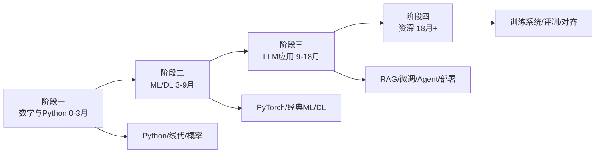

# AI/LLM 工程师学习路线图

> 从「会调 OpenAI 接口」到「能训练/微调/部署一个 LLM 应用」，分四个阶段。强调工程落地，不堆砌数学证明。

---

## 阶段一：数学与 Python 基础 0-3 个月

目标：补够读论文和写模型代码所需的数学直觉与 Python 工程能力。

- **1. Python 进阶** —— 学什么：列表推导、生成器、装饰器、类型提示。学到什么程度：能读懂开源 ML 项目代码。常见坑：会写脚本但不工程化。资源：[廖雪峰 Python](https://www.liaoxuefeng.com/wiki/1016959663602400)
- **2. NumPy** —— 学什么：ndarray、广播、矩阵运算。学到什么程度：不用 for 循环做矩阵乘。常见坑：维度搞错。资源：[NumPy 中文](https://www.runoob.com/numpy/numpy-tutorial.html)
- **3. Pandas** —— 学什么：DataFrame、groupby、merge、清洗。学到什么程度：能处理一个 CSV 数据集。常见坑：不用向量化。资源：[Pandas 中文](https://www.pypandas.cn/)
- **4. Matplotlib/Seaborn** —— 学什么：画图、分布、曲线。学到什么程度：能把训练损失画出来。常见坑：图不标坐标轴。资源：[Matplotlib](https://matplotlib.org/stable/)
- **5. 线性代数直觉** —— 学什么：向量、矩阵乘法、特征值、SVD 直觉（不背证明）。学到什么程度：能说清 embedding 矩阵在干嘛。常见坑：被数学推导劝退。资源：[3Blue1Brown 线代](https://www.bilibili.com/video/BV1ys411472E/)
- **6. 概率与统计** —— 学什么：分布、期望、贝叶斯、极大似然。学到什么程度：能理解交叉熵损失。常见坑：概率论全还给老师。资源：[3Blue1Brown 概率](https://www.bilibili.com/video/BV1gb41137u4/)
- **7. 微积分直觉** —— 学什么：导数、梯度、链式法则。学到什么程度：能理解反向传播在求什么。常见坑：手推公式推不动。资源：[Khan 微积分](https://www.khanacademy.org/math/calculus-1)
- **8. 命令行与 Git** —— 学什么：参考[计算机基础路线](./06-cs-foundation.md)对应节点。学到什么程度：能拉 GitHub 项目跑起来。常见坑：不会 clone 别人代码。资源：[Pro Git](https://git-scm.com/book/zh/v2)
- **9. CUDA/GPU 认知** —— 学什么：为什么 GPU 快、显存概念、装 PyTorch。学到什么程度：知道 OOM 是显存不够。常见坑：CPU 跑大模型。资源：[CUDA Toolkit](https://developer.nvidia.com/cuda-toolkit)
- **10. 虚拟环境** —— 学什么：conda/venv、环境隔离。学到什么程度：不同项目不打架。常见坑：全局 pip 乱装。资源：[Conda](https://docs.conda.io/)
- **11. 第一个 Notebook** —— 学什么：Jupyter、实验记录。学到什么程度：能边写边看数据。常见坑：Notebook 写成屎山。资源：[Jupyter](https://docs.jupyter.org/)
- **12. 吴恩达 ML 课** —— 学什么：线性回归、逻辑回归、神经网络概念。学到什么程度：能看懂课程作业。常见坑：只看视频不做作业。资源：[Coursera ML](https://www.coursera.org/learn/machine-learning)
- **13. 特征工程** —— 学什么：归一化、类别编码、缺失值。学到什么程度：能清洗一份真实表格数据。常见坑：不做特征直接喂模型。资源：[sklearn 预处理](https://scikit-learn.org/stable/modules/preprocessing.html)
- **14. scikit-learn** —— 学什么：训练/验证/测试划分、常见模型。学到什么程度：能跑一个分类 baseline。常见坑：测试集当验证集。资源：[sklearn 中文](https://scikit-learn.org.cn/)
- **15. 过拟合与正则化** —— 学什么：训练/验证曲线、dropout/L2。学到什么程度：能说清过拟合表现。常见坑：训练集准确率 99% 就觉得好。资源：[学习曲线](https://scikit-learn.org/stable/auto_examples/model_selection/plot_learning_curve.html)

**阶段一过线标准**：用 sklearn 在一个真实表格数据集上跑出一个分类 baseline，能画学习曲线。

---

## 阶段二：机器学习与深度学习 3-9 个月

目标：理解神经网络怎么学东西，能用 PyTorch 训练一个小模型。

- **16. 神经网络基础** —— 学什么：前向传播、激活函数、损失、反向传播。学到什么程度：能手写一层线性层。常见坑：只会调库不理解。资源：[3Blue1Brown DL](https://www.bilibili.com/video/BV1bx411M7Zp/)
- **17. PyTorch 入门** —— 学什么：Tensor、autograd、nn.Module、DataLoader。学到什么程度：能写一个 MNIST 分类。常见坑：不用 DataLoader 手批数据。资源：[PyTorch 中文教程](https://pytorch.org/tutorials/beginner/basics/intro-zh.html)
- **18. 损失函数** —— 学什么：MSE、交叉熵、分类 vs 回归。学到什么程度：能给一个任务选损失。常见坑：回归用交叉熵。资源：[PyTorch losses](https://pytorch.org/docs/stable/nn.html#loss-functions)
- **19. 优化器** —— 学什么：SGD、Adam、学习率、weight decay。学到什么程度：能调学习率让 loss 下降。常见坑：学习率 1e-3 用到底。资源：[优化器可视化](https://github.com/ilgen/optimization-viz)
- **20. CNN 卷积网络** —— 学什么：卷积、池化、特征图。学到什么程度：能训一个 CIFAR-10。常见坑：把全连接当万能。资源：[PyTorch CIFAR10](https://pytorch.org/tutorials/beginner/blitz/cifar10_tutorial.html)
- **21. RNN 与序列建模** —— 学什么：为什么序列建模难、LSTM 直觉。学到什么程度：知道为什么 Transformer 出来了。常见坑：上来直接 Transformer。资源：[Understanding LSTM](https://colah.github.io/posts/2015-08-Understanding-LSTMs/)
- **22. Attention 与 Transformer** —— 学什么：自注意力、Q/K/V、多头、Encoder-Decoder。学到什么程度：能画清楚一个 Transformer block。常见坑：只看论文图不推。资源：[Illustrated Transformer](https://jalammar.github.io/illustrated-transformer/)
- **23. 预训练与微调** —— 学什么：为什么大模型可以预训练再微调。学到什么程度：能说清 fine-tune 在改什么。常见坑：全参数微调小显存扛不住。资源：[Hugging Face Learn](https://huggingface.co/learn)
- **24. Tokenization 与 Embedding** —— 学什么：BPE、embedding 表。学到什么程度：能说清"猫"怎么变成向量。常见坑：把 token 当字。资源：[HF tokenizer](https://huggingface.co/learn/llm-course/zh-CN/chapter2/4)
- **25. Hugging Face Transformers** —— 学什么：pipeline、from_pretrained、tokenizer。学到什么程度：能加载一个开源模型跑推理。常见坑：下了模型不知道怎么用。资源：[HF Transformers](https://huggingface.co/docs/transformers)
- **26. 训练循环** —— 学什么：batch、epoch、eval、checkpoint。学到什么程度：能写一个完整训练脚本。常见坑：不保存最好模型。资源：[PyTorch 训练循环](https://pytorch.org/tutorials/beginner/basics/optimization_tutorial.html)
- **27. 过拟合实战** —— 学什么：dropout、early stopping、数据增强。学到什么程度：验证集比训练集差不慌。常见坑：epoch 越多越好。资源：[HF 训练课](https://huggingface.co/learn/llm-course/zh-CN/chapter3)
- **28. 数据清洗与标注** —— 学什么：脏数据、标注规范、质量比数量重要。学到什么程度：能设计一份标注规范。常见坑：模型不行就加数据，不看质量。资源：[Label Studio](https://labelstud.io/)
- **29. 机器学习项目流程** —— 学什么：问题定义→数据→baseline→迭代。学到什么程度：能走完一个 Kaggle 赛题。常见坑：一开始就上大模型。资源：[Kaggle Learn](https://www.kaggle.com/learn)
- **30. 评估指标** —— 学什么：准确率/精确率/召回率/F1/AUC。学到什么程度：类别不平衡时不用准确率。常见坑：只看 accuracy。资源：[sklearn 指标](https://scikit-learn.org/stable/modules/model_evaluation.html)

**阶段二过线标准**：用 PyTorch 从零训练一个小分类器，能说清每一步在干嘛；能加载 HF 模型跑通推理。

---

## 阶段三：LLM 应用与工程 9-18 个月

目标：能基于开源/API 模型做出真实可用的 LLM 产品，理解 RAG、微调、Agent。

- **31. OpenAI 兼容 API** —— 学什么：chat/completions、system/user/assistant 消息。学到什么程度：能写一个带上下文的聊天脚本。常见坑：忘了维护对话历史。资源：[OpenAI Docs](https://platform.openai.com/docs)
- **32. Prompt Engineering** —— 学什么：few-shot、思维链、角色设定。学到什么程度：能通过改 prompt 把准确率提 20%。常见坑：把 prompt 当魔法。资源：[Prompt Guide 中文](https://www.promptingguide.ai/zh)
- **33. Token 与成本** —— 学什么：tokenizer、上下文窗口、计费。学到什么程度：能算一次请求多少钱。常见坑：不控制上下文长度。资源：[OpenAI tokenizer](https://platform.openai.com/tokenizer)
- **34. 流式输出** —— 学什么：SSE streaming、打字机效果。学到什么程度：前端能逐字显示。常见坑：等全部返回再渲染。资源：[OpenAI streaming](https://platform.openai.com/docs/api-reference/streaming)
- **35. Embedding 与向量** —— 学什么：文本转向量、相似度。学到什么程度：能做一个语义搜索 demo。常见坑：用关键词匹配冒充语义。资源：[Sentence Transformers](https://huggingface.co/docs/transformers/model_doc/sentence-transformers)
- **36. 向量数据库** —— 学什么：Chroma/Milvus/pgvector、检索。学到什么程度：能存 10 万条文档向量并检索。常见坑：把向量库当主库。资源：[Milvus 中文](https://milvus.io/docs)
- **37. RAG 检索增强** —— 学什么：文档切分、embedding、检索、拼 prompt。学到什么程度：能做一个"问自己文档"的机器人。常见坑：切分 chunk 太大或太小。资源：[LangChain RAG](https://python.langchain.com/docs/tutorials/rag/)
- **38. RAG 优化** —— 学什么：重排序、混合检索、query 改写。学到什么程度：能把 RAG 召回准确率提上去。常见坑：首屏向量检索完事。资源：[Pinecone RAG](https://www.pinecone.io/learn/retrieval-augmented-generation/)
- **39. LangChain/LlamaIndex** —— 学什么：链式调用、工具抽象。学到什么程度：能搭一个多步检索流程。常见坑：被框架抽象绑死。资源：[LangChain](https://python.langchain.com/docs/)
- **40. Function Calling** —— 学什么：让模型决定调哪个工具。学到什么程度：能做一个查天气/查数据库的助手。常见坑：工具描述写不清。资源：[OpenAI function calling](https://platform.openai.com/docs/guides/function-calling)
- **41. Agent 概念** —— 学什么：规划、工具使用、记忆、循环。学到什么程度：能说清 ReAct 范式。常见坑：把一次 function call 当 Agent。资源：[ReAct](https://react-lm.github.io/)
- **42. 开源模型本地跑** —— 学什么：Ollama/llama.cpp 跑 7B 模型。学到什么程度：本地能跑 Llama/Qwen。常见坑：下载了模型不知道怎么加载。资源：[Ollama](https://ollama.com/)
- **43. 模型选型** —— 学什么：闭源 API vs 开源自托管，成本/隐私/质量。学到什么程度：能给一个场景选模型。常见坑：什么都用 GPT-4。资源：[LMSYS 榜单](https://huggingface.co/spaces/open-llm-leaderboard/open_llm_leaderboard)
- **44. 微调入门 LoRA** —— 学什么：LoRA/QLoRA、为什么省显存。学到什么程度：能用 LoRA 在自己数据上微调一个 7B。常见坑：全参数微调爆显存。资源：[PEFT](https://huggingface.co/docs/peft)
- **45. 指令数据构造** —— 学什么：(指令, 输入, 输出) 三元组、数据质量。学到什么程度：能造 1000 条高质量指令数据。常见坑：数据量大好。资源：[Alpaca](https://github.com/tatsu-lab/stanford_alpaca)
- **46. 对齐概念** —— 学什么：SFT、RLHF/DPO 直觉。学到什么程度：能说清预训练和对齐区别。常见坑：把对齐当训练万能药。资源：[InstructGPT](https://arxiv.org/abs/2203.02155)
- **47. LLM 评估** —— 学什么：人工评估、自动评估、benchmark。学到什么程度：能说清你的 RAG 系统比上周好多少。常见坑：凭感觉觉得变聪明了。资源：[lm-evaluation-harness](https://github.com/EleutherAI/lm-evaluation-harness)
- **48. 幻觉问题** —— 学什么：引用来源、置信度、拒答。学到什么程度：能让模型在不知道时说不知道。常见坑：强问强答。资源：[Pinecone 幻觉](https://www.pinecone.io/learn/hallucination/)
- **49. 结构化输出** —— 学什么：JSON mode、function calling 约束输出。学到什么程度：模型稳定输出可解析 JSON。常见坑：用正则修 JSON。资源：[Structured outputs](https://platform.openai.com/docs/guides/structured-outputs)
- **50. 缓存与限流** —— 学什么：相同 query 缓存、速率限制。学到什么程度：成本能降一半。常见坑：每个请求都调 API。资源：[Redis](https://redis.io/docs/)
- **51. LLM 应用部署** —— 学什么：FastAPI 包模型接口、并发、超时。学到什么程度：能起一个生产可用的 LLM 服务。常见坑：同步阻塞。资源：[FastAPI 中文](https://fastapi.tiangolo.com/zh/)
- **52. 日志与观测** —— 学什么：prompt/response/延迟/token 记录。学到什么程度：出问题能复现。常见坑：日志不记 prompt。资源：[LangSmith](https://docs.smith.langchain.com/)
- **53. 多模态概念** —— 学什么：图文模型能做什么。学到什么程度：能调一个图文 API。常见坑：期望它万能。资源：[Qwen-VL](https://qianwen-vl.readthedocs.io/)
- **54. 安全与合规** —— 学什么：prompt 注入、内容审核、数据隐私。学到什么程度：能挡住简单越权。常见坑：把用户输入直接拼系统 prompt。资源：[OWASP LLM Top 10](https://owasp.org/www-project-top-ten/)

**阶段三过线标准**：上线一个真实 LLM 应用（RAG/Agent/聊天助手），有评估、有监控、有真实用户。

---

## 阶段四：资深 18 个月+（训练系统、评测体系、产品化）

- **55. 预训练认知** —— 学什么：大规模数据、分布式训练、吞吐。学到什么程度：能说清预训练一个 7B 要多少卡。常见坑：以为预训练等于微调。资源：[LLM 预训练综述](https://arxiv.org/abs/2309.01880)
- **56. 分布式训练** —— 学什么：数据并行、张量并行、ZeRO。学到什么程度：能跑通一个多卡训练。常见坑：单卡 OOM 就放弃。资源：[DeepSpeed](https://www.deepspeed.ai/)
- **57. 推理优化** —— 学什么：vLLM、量化、KV Cache、批量。学到什么程度：能把 QPS 提几倍。常见坑：用 HF pipeline 直接上线。资源：[vLLM](https://docs.vllm.ai/)
- **58. 评测体系搭建** —— 学什么：离线评测集、线上 A/B、人工抽检。学到什么程度：每次改模型都有数据说话。常见坑：靠 case 感觉。资源：[Promptfoo](https://www.promptfoo.dev/)
- **59. 数据飞轮** —— 学什么：bad case 收集→标注→微调→上线。学到什么程度：系统越用越好。常见坑：数据用完即弃。资源：[HF Feedback](https://huggingface.co/blog/feedback-loop)
- **60. 成本与延迟权衡** —— 学什么：小模型兜底、大模型升级、缓存。学到什么程度：既快又便宜。常见坑：全量大模型。资源：[Anthropic](https://www.anthropic.com/news)
- **61. Agent 工程化** —— 学什么：工具可靠调用、错误重试、人工兜底。学到什么程度：Agent 失败有挽回路径。常见坑：让 Agent 自由发挥。资源：[LangGraph](https://langchain-ai.github.io/langgraph/)
- **62. 模型版权与合规** —— 学什么：训练数据版权、输出合规。学到什么程度：知道商用边界。常见坑：拿 GPL 模型闭源商用。资源：[HF 模型许可](https://huggingface.co/docs/hub/models-licenses)
- **63. 技术决策** —— 学什么：什么时候自研、什么时候用 API。学到什么程度：能写一页选型论证。常见坑：为了技术自研。资源：[LMSYS 榜单](https://huggingface.co/spaces/open-llm-leaderboard/open_llm_leaderboard)
- **64. 论文阅读与带人** —— 学什么：每周一篇论文、落地判断。学到什么程度：能从论文里挑出可落地的。常见坑：追每一篇新论文。资源：[arXiv cs.CL](https://arxiv.org/list/cs.CL/recent)
- **65. 评测集构建** —— 学什么：从真实 case 出发标注评测集。学到什么程度：100 条人工标注代表线上分布。常见坑：用公开 benchmark 当业务评测。资源：[Promptfoo](https://www.promptfoo.dev/docs/intro/)
- **66. 提示词版本管理** —— 学什么：prompt 入库、灰度、A/B。学到什么程度：改 prompt 像改代码一样可回滚。常见坑：prompt 散在代码里。资源：[LangSmith](https://docs.smith.langchain.com/)
- **67. 多轮对话记忆** —— 学什么：会话摘要、窗口裁剪。学到什么程度：长对话不爆 token。常见坑：把全部历史塞进去。资源：[LangChain 内存](https://python.langchain.com/docs/modules/memory/)
- **68. 结构化数据抽取** —— 学什么：从长文本抽 JSON 表格。学到什么程度：能做一个发票抽取。常见坑：一次抽太多字段。资源：[Outlines](https://dottxt-ai.github.io/outlines/)
- **69. 模型路由** —— 学什么：简单问题小模型、复杂大模型。学到什么程度：成本降一半。常见坑：全量 GPT-4。资源：[OpenRouter](https://openrouter.ai/docs)
- **70. 推理缓存** —— 学什么：语义缓存、相同问题直接返回。学到什么程度：热门问题秒回。常见坑：每次都调 API。资源：[Redis LLM](https://redis.io/learn/develop/serverless/rag-with-redis)
- **71. 安全防护** —— 学什么：prompt 注入、越狱防护、输出审核。学到什么程度：能挡住常见越权。常见坑：不做输入过滤。资源：[Llama Guard](https://huggingface.co/meta-llama/Llama-Guard-3-8B)
- **72. 端侧模型** —— 学什么：手机/浏览器跑小模型。学到什么程度：能在 Web 跑一个小模型。常见坑：什么都上云。资源：[WebLLM](https://webllm.mlc.ai/)

**阶段四过线标准**：主导过一个 LLM 系统从原型到生产，有可量化的效果提升和成本控制。

---

## 学习资源清单

- [Hugging Face Learn](https://huggingface.co/learn) —— 官方免费 LLM 课
- [PyTorch 中文教程](https://pytorch.org/tutorials/beginner/basics/intro-zh.html)
- [3Blue1Brown 神经网络系列](https://www.bilibili.com/video/BV1bx411M7Zp/) —— 直觉
- [Ollama](https://ollama.com/) —— 本地跑模型
- [Prompt Engineering Guide 中文](https://www.promptingguide.ai/zh)
- [OpenAI Docs](https://platform.openai.com/docs)
- [Coursera 吴恩达 ML](https://www.coursera.org/learn/machine-learning)

## 常见坑

1. **跳过数学直接调 API**：能跑 demo 但解决不了问题。
2. **追模型不做产品**：模型每周更新，业务沉淀才是护城河。
3. **不做评估**：没数字就没法改进。
4. **忽视成本**：LLM 应用烧钱速度超想象。
