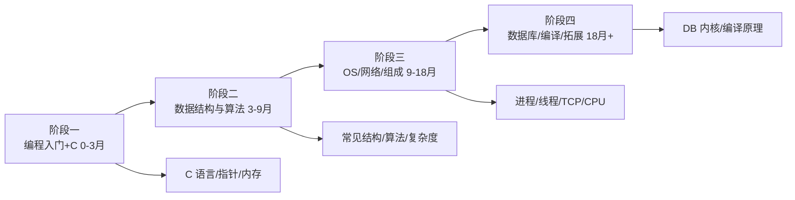

# 计算机基础学习路线图

> 不依附于任何语言或框架——操作系统、网络、数据结构、体系结构。这部分学完，换任何语言都不慌。分四个阶段。

---

## 阶段一：编程入门与 C 语言 0-3 个月

目标：理解程序到底怎么跑在机器上，建立内存和指针的直觉。

- **1. CS50 入门课** —— 学什么：计算机科学导论、Scratch→C。学到什么程度：跟完所有 lecture 和 problem set。常见坑：只看视频不做作业。资源：[CS50](https://cs50.harvard.edu/x/)
- **2. 编译过程** —— 学什么：预处理→编译→汇编→链接。学到什么程度：能说清 .c 怎么变成可执行文件。常见坑：以为编译器是黑盒。资源：[CS50 编译](https://cs50.harvard.edu/x/2024/weeks/0/)
- **3. C 基本语法** —— 学什么：变量、循环、函数、数组。学到什么程度：能写一个 200 行的 C 程序。常见坑：不初始化变量。资源：[菜鸟 C 语言](https://www.runoob.com/cprogramming/c-tutorial.html)
- **4. 指针** —— 学什么：地址、解引用、指针与数组。学到什么程度：能手写一个字符串拷贝。常见坑：野指针。资源：[C 指针](https://www.runoob.com/cprogramming/c-pointers.html)
- **5. 内存模型** —— 学什么：栈/堆/全局区、malloc/free。学到什么程度：能说清一个变量在哪。常见坑：malloc 不 free。资源：[CS50 内存](https://cs50.harvard.edu/x/2024/weeks/4/)
- **6. 结构体与 typedef** —— 学什么：自定义类型、结构体指针。学到什么程度：能设计一个链表节点。常见坑：值传递结构体。资源：[C 结构体](https://www.runoob.com/cprogramming/c-structures.html)
- **7. 文件 I/O** —— 学什么：fopen/fread/fwrite。学到什么程度：能读写一个文本文件。常见坑：不检查返回值。资源：[C 文件读写](https://www.runoob.com/cprogramming/c-file-io.html)
- **8. 命令行参数** —— 学什么：argc/argv。学到什么程度：能写一个带参数的命令行工具。常见坑：argv 越界。资源：[CS50 C 教程](https://cs50.harvard.edu/x/2024/weeks/1/)
- **9. 调试器 gdb** —— 学什么：断点、单步、看内存。学到什么程度：不用 printf 也能定位段错误。常见坑：靠猜。资源：[GDB 文档](https://www.gnu.org/software/gdb/documentation/)
- **10. 位运算** —— 学什么：与或非异或、移位、掩码。学到什么程度：能写一个判断奇偶的位运算。常见坑：从不写位运算。资源：[LeetCode](https://leetcode.cn/problemset/)
- **11. 递归** —— 学什么：递归三要素、栈溢出。学到什么程度：能手写斐波那契和汉诺塔。常见坑：不写终止条件。资源：[CS50 递归](https://cs50.harvard.edu/x/2024/weeks/2/)
- **12. 大端小端** —— 学什么：多字节数据在内存的字节序。学到什么程度：能写代码判断大小端。常见坑：网络协议不转字节序。资源：[字节序](https://www.ruanyifeng.com/blog/2016/11/byte-order.html)
- **13. 数制** —— 学什么：二/八/十/十六进制转换。学到什么程度：看到 0xFF 不懵。常见坑：和二进制斗争。资源：[数制转换](https://www.runoob.com/w3cnote/hex-dec-bin-convert.html)
- **14. 第一个小项目** —— 学什么：用 C 写一个命令行小游戏或文件工具。学到什么程度：编译跑起来。常见坑：半途而废。资源：[CS50 problem set](https://cs50.harvard.edu/x/2024/psets/)

**阶段一过线标准**：能徒手写链表、理解指针和内存布局、用 gdb 调试 C 程序。

---

## 阶段二：数据结构与算法 3-9 个月

目标：能在 1 小时白板上解出一道中等题，理解每种结构的适用场景。

- **15. 复杂度分析** —— 学什么：时间/空间复杂度、大 O。学到什么程度：看一段代码能估复杂度。常见坑：O(n²) 当 O(n)。资源：[复杂度](https://www.runoob.com/data-structures/data-structures-asymptotic-analysis.html)
- **16. 数组与动态数组** —— 学什么：连续内存、随机访问 O(1)、插入 O(n)。学到什么程度：能手写一个动态数组。常见坑：不知道为什么要搬移。资源：[数组](https://www.runoob.com/data-structures/array-adv.html)
- **17. 链表** —— 学什么：单/双链表、反转、环检测。学到什么程度：LeetCode 反转链表秒杀。常见坑：断链。资源：[链表练习](https://leetcode.cn/leetbook/read/linked-list/)
- **18. 栈** —— 学什么：LIFO、括号匹配、单调栈。学到什么程度：能写一个计算器。常见坑：栈和队列混。资源：[栈](https://www.runoob.com/data-structures/stack.html)
- **19. 队列** —— 学什么：FIFO、循环队列、双端队列。学到什么程度：能实现一个 BFS 队列。资源：[队列](https://www.runoob.com/data-structures/queue.html)
- **20. 哈希表** —— 学什么：哈希函数、冲突处理、负载因子。学到什么程度：能说清 HashMap 扩容。常见坑：用数组当哈希表。资源：[哈希表](https://www.runoob.com/data-structures/hash-table.html)
- **21. 二叉树** —— 学什么：前中后序遍历、层序。学到什么程度：三种遍历递归+迭代都写得出。常见坑：迭代遍历栈用错。资源：[二叉树](https://www.runoob.com/data-structures/binary-search-tree.html)
- **22. 二叉搜索树** —— 学什么：插入/查找/删除、为什么不平衡就退化。学到什么程度：能说清 BST 退化成链表。资源：[BST](https://www.runoob.com/data-structures/binary-search-tree.html)
- **23. 堆与优先队列** —— 学什么：大/小顶堆、top K 问题。学到什么程度：能用堆找前 K 大。常见坑：不会上浮下沉。资源：[堆](https://www.runoob.com/data-structures/heap.html)
- **24. 图基础** —— 学什么：邻接表、BFS、DFS。学到什么程度：能写迷宫求解。常见坑：遍历 visited 忘了标记。资源：[图](https://www.runoob.com/data-structures/graph.html)
- **25. 排序算法** —— 学什么：冒泡/选择/插入/快排/归并/堆排。学到什么程度：能手写快排和归并。常见坑：只会调 sort。资源：[排序可视化](https://visualgo.net/zh/sorting)
- **26. 二分查找** —— 学什么：边界、开闭区间。学到什么程度：能写对二分找第一个≥x。常见坑：死循环。资源：[二分查找](https://leetcode.cn/leetbook/read/binary-search/)
- **27. 递归与分治** —— 学什么：归并、快速幂。学到什么程度：能写一个分治算法。资源：[分治](https://www.runoob.com/data-structures/divide-conquer.html)
- **28. 动态规划入门** —— 学什么：状态定义、转移方程、背包。学到什么程度：能解爬楼梯/打家劫舍。常见坑：状态定义错。资源：[DP 路线](https://leetcode.cn/circle/discuss/K0n2gO/)
- **29. 动态规划进阶** —— 学什么：最长子序列、编辑距离。学到什么程度：能解中等 DP。常见坑：以为 DP 是背题。资源：[代码随想录](https://programmercarl.com/)
- **30. 贪心** —— 学什么：证明、区间调度。学到什么程度：能识别该贪心还是该 DP。常见坑：瞎贪。资源：[贪心](https://www.runoob.com/data-structures/greedy-algorithm.html)
- **31. LeetCode 训练** —— 学什么：按标签刷，不是按题号。学到什么程度：中等题有思路。常见坑：刷 500 道还是不会。资源：[LeetCode 中国](https://leetcode.cn/)
- **32. 算法工程权衡** —— 学什么：不是 O 越小越好，常数和内存也要看。学到什么程度：能在简单实现和复杂优化间选。常见坑：面试思维解生产问题。资源：[High Scalability](https://highscalability.com/)
- **33. 字符串处理** —— 学什么：KMP 直觉、Trie。学到什么程度：能做一个前缀匹配。常见坑：暴力匹配。资源：[Trie](https://www.runoob.com/data-structures/trie.html)
- **34. 并查集** —— 学什么：连通性、路径压缩。学到什么程度：能解朋友圈问题。资源：[并查集](https://www.runoob.com/data-structures/disjoint-set.html)
- **35. 滑动窗口** —— 学什么：双指针、窗口伸缩。学到什么程度：能解最长无重复子串。常见坑：窗口边界。资源：[滑动窗口](https://leetcode.cn/circle/discuss/0VuRzZ/)

**阶段二过线标准**：LeetCode 中等题 30 分钟有思路并写对，能手写快排/归并/二分。

---

## 阶段三：操作系统、网络、组成原理 9-18 个月

目标：理解程序跑起来后，操作系统和网络在背后做了什么。

- **36. 操作系统是什么** —— 学什么：管理硬件、给程序抽象。学到什么程度：能说清 OS 在程序和硬件之间的角色。常见坑：把 OS 当软件合集。资源：[OS 导论](https://www.operating-systemguide.com/)
- **37. 进程** —— 学什么：PCB、状态转换、fork。学到什么程度：能画进程状态图。常见坑：进程和线程混。资源：[Linux 进程](https://www.runoob.com/linux/linux-process-management.html)
- **38. 线程** —— 学什么：线程共享什么、上下文切换。学到什么程度：能说清线程比进程轻在哪。常见坑：线程安全意识没有。资源：[线程](https://www.runoob.com/java/java-multithreading.html)
- **39. 进程间通信** —— 学什么：管道、消息队列、共享内存、信号量。学到什么程度：能选一种 IPC。常见坑：不知道共享内存最快。资源：[Linux IPC](https://www.runoob.com/linux/linux-ipc.html)
- **40. 锁与同步** —— 学什么：互斥锁、条件变量、死锁。学到什么程度：能说清死锁四条件。常见坑：锁粒度太大。资源：[同步互斥](https://www.runoob.com/operating-system/os-process-synchronization.html)
- **41. 内存管理** —— 学什么：虚拟内存、分页、缺页。学到什么程度：能说清为什么 32 位机器不能用全部物理内存。常见坑：以为内存直接是物理地址。资源：[虚拟内存](https://www.runoob.com/operating-system/os-memory-management.html)
- **42. 页面置换** —— 学什么：LRU、缺页率。学到什么程度：能说清为什么 LRU 实际用近似。常见坑：纸上谈兵。资源：[页面置换](https://www.runoob.com/operating-system/os-page-replacement-algorithm.html)
- **43. 文件系统** —— 学什么：inode、目录、日志。学到什么程度：能说清一个文件存在哪。资源：[inode](https://www.runoob.com/linux/linux-filesystem.html)
- **44. 调度算法** —— 学什么：FCFS/SJF/时间片。学到什么程度：能说清为什么要有时间片。资源：[CPU 调度](https://www.runoob.com/operating-system/os-scheduling-algorithms.html)
- **45. 中断与系统调用** —— 学什么：用户态/内核态、trap。学到什么程度：能说清 printf 怎么到屏幕。常见坑：以为写文件是用户态做的。资源：[系统调用](https://www.runoob.com/operating-system/os-system-calls.html)
- **46. 计算机组成** —— 学什么：CPU/内存/总线、取指执行。学到什么程度：能说清一条指令的生命周期。资源：[Nand2Tetris](https://www.nand2tetris.org/)
- **47. 缓存层级** —— 学什么：L1/L2/L3、局部性原理。学到什么程度：能说清为什么数组比链表快。常见坑：不理解缓存命中。资源：[CPU 缓存](https://mechandmeme.com/)
- **48. 指令流水线** —— 学什么：为什么流水线加速、冒险。学到什么程度：有概念即可。资源：[组成原理](https://www.runoob.com/computer-system-organization/)
- **49. TCP/IP 分层** —— 学什么：应用/传输/网络/链路层各司其职。学到什么程度：能说清 DNS 在哪层。常见坑：每层职责不清。资源：[TCP/IP 详解](https://developer.aliyun.com/article/706851)
- **50. TCP 可靠传输** —— 学什么：序列号、ACK、超时重传、滑动窗口。学到什么程度：能说清 TCP 怎么知道数据到了。常见坑：以为 TCP 绝对可靠。资源：[TCP](https://www.runoob.com/note/11293)
- **51. TCP 流量与拥塞控制** —— 学什么：慢启动、拥塞避免。学到什么程度：能说清为什么网络卡时传输变慢。常见坑：和流量控制混。资源：[拥塞控制](https://www.cloudflare.com/zh-cn/learning/ddos/glossary/tcp-ip/)
- **52. UDP** —— 学什么：无连接、适用场景（视频/DNS）。学到什么程度：能说清什么时候用 UDP。资源：[UDP](https://www.runoob.com/note/11293)
- **53. 三次握手四次挥手** —— 学什么：为什么三次、TIME_WAIT。学到什么程度：能手画并解释。常见坑：背答案不理解。资源：[三次握手](https://www.runoob.com/note/11293)
- **54. HTTP 与 HTTPS** —— 学什么：HTTP 无状态、TLS 握手、证书。学到什么程度：能说清 HTTPS 比 HTTP 多了什么。常见坑：以为 HTTPS 只是加密内容。资源：[HTTPS](https://www.ruanyifeng.com/blog/2014/09/what-is-https.html)
- **55. DNS** —— 学什么：递归查询、缓存、记录类型。学到什么程度：能 dig 出域名解析过程。常见坑：域名解析挂了不知道。资源：[DNS](https://www.runoob.com/dns/dns-tutorial.html)
- **56. 浏览器输入 URL 后** —— 学什么：把上面所有串起来。学到什么程度：能讲 5 分钟。常见坑：背八股不讲细节。资源：[Chrome 网络](https://developer.chrome.com/docs/devtools/network)
- **57. 网络排查** —— 学什么：ping/traceroute/dig/tcpdump。学到什么程度：能定位是哪一跳的问题。常见坑：只会 ping。资源：[tcpdump](https://www.tcpdump.org/)
- **58. 常见协议** —— 学什么：DNS/DHCP/ICMP/SSH 大概干嘛。学到什么程度：看到端口号能认出协议。资源：[端口号](https://www.runoob.com/note/11293)
- **59. 并发编程** —— 学什么：竞态、临界区、原子操作。学到什么程度：能写一个线程安全计数器。常见坑：i++ 以为原子。资源：[Java 并发](https://www.runoob.com/java/java-multithreading.html)
- **60. 死锁实战** —— 学什么：预防、避免、检测。学到什么程度：能在日志里认出死锁。资源：[死锁](https://www.runoob.com/operating-system/os-deadlock.html)

**阶段三过线标准**：能讲清"浏览器输入 URL 到页面渲染"涉及的 OS + 网络知识点；能手写线程安全队列。

---

## 阶段四：数据库内核、编译原理与拓展 18 个月+

- **61. 数据库存储结构** —— 学什么：B+ 树索引、页。学到什么程度：能说清为什么数据库用 B+ 树不用二叉树。常见坑：只知道索引快。资源：[MySQL 索引](https://dev.mysql.com/doc/refman/8.0/en/innodb-index-types.html)
- **62. 事务实现** —— 学什么：WAL、MVCC、锁。学到什么程度：能说清 RR 隔离怎么实现。常见坑：只会用 BEGIN/COMMIT。资源：[MySQL MVCC](https://dev.mysql.com/doc/refman/8.0/en/innodb-multi-versioning.html)
- **63. 日志系统** —— 学什么：binlog/redo log。学到什么程度：能说清两阶段提交。资源：[MySQL 日志](https://dev.mysql.com/doc/refman/8.0/en/binary-log.html)
- **64. 编译原理直觉** —— 学什么：词法/语法分析、AST。学到什么程度：能说清 LSP 在干嘛。常见坑：一上来写完整编译器。资源：[Crafting Interpreters](https://craftinginterpreters.com/)
- **65. 自动内存管理** —— 学什么：GC 分代、标记清除。学到什么程度：能说清 Java/Go GC 在做什么。常见坑：以为 C 没有内存管理。资源：[GC 手册](https://www.oracle.com/webfolder/technetwork/tutorials/obe/java/gc01/index.html)
- **66. 虚拟化概念** —— 学什么：VM/容器、hypervisor。学到什么程度：能说清容器不是虚拟机。常见坑：Docker 是虚拟机。资源：[Docker vs VM](https://www.docker.com/resources/what-container/)
- **67. 分布式系统** —— 学什么：CAP、一致性、Paxos/Raft 直觉。学到什么程度：能说清为什么分布式难。常见坑：看论文看不动。资源：[DDIA](https://dataintensive.net/)
- **68. 一致性模型** —— 学什么：强一致/最终一致。学到什么程度：能给业务选一致性级别。资源：[CAP 定理](https://en.wikipedia.org/wiki/CAP_theorem)
- **69. 安全基础** —— 学什么：对称/非对称加密、证书、哈希。学到什么程度：能说清 HTTPS 加密过程。常见坑：自己设计加密算法。资源：[OWASP](https://owasp.org/)
- **70. 正则表达式** —— 学什么：匹配、分组、贪婪。学到什么程度：能写一个邮箱校验正则。常见坑：用 HTML 解析器正则。资源：[MDN 正则](https://developer.mozilla.org/zh-CN/docs/Web/JavaScript/Guide/Regular_expressions)
- **71. 编码** —— 学什么：ASCII/UTF-8/Unicode、BOM。学到什么程度：能说清为什么中文乱码。常见坑：以为中文一个字两个字节。资源：[字符编码](https://www.ruanyifeng.com/blog/2007/10/ascii_unicode_and_utf-8.html)
- **72. 位运算实战** —— 学什么：状态压缩、位图。学到什么程度：能用位图存 1 亿个数存在性。资源：[Bitmap](https://en.wikipedia.org/wiki/Bitmap)
- **73. 性能分析** —— 学什么：perf、火焰图。学到什么程度：能找出程序最热的函数。常见坑：瞎优化。资源：[火焰图](https://www.brendangregg.com/flamegraphs.html)
- **74. 英文原版书** —— 学什么：挑一本经典系统书读。学到什么程度：能读英文技术书。常见坑：等中译本。资源：[CSAPP](https://www.csapp.cs.cmu.edu/)
- **75. 长期学习习惯** —— 学什么：不背八股，造东西。学到什么程度：有自己写的小工具/小实验。常见坑：刷题不写代码。资源：[Build your own X](https://github.com/codecrafters-io/build-your-own-x)
- **76. 一致性哈希** —— 学什么：分布式缓存节点扩缩容。学到什么程度：能说清为什么普通取模不行。常见坑：哈希取模。资源：[一致性哈希](https://en.wikipedia.org/wiki/Consistent_hashing)
- **77. 布隆过滤器** —— 学什么：判断不存在、容忍误判。学到什么程度：能挡缓存穿透。常见坑：用布隆存精确数据。资源：[布隆过滤器](https://en.wikipedia.org/wiki/Bloom_filter)
- **78. 时间复杂度实战** —— 学什么：别只背大 O，看常数和缓存。学到什么程度：能在简单与复杂间选。资源：[Agner Fog](https://agner.org/optimize/)
- **79. 编译优化直觉** —— 学什么：内联、循环展开、O2。学到什么程度：知道 -O2 在干嘛。常见坑：所有编译选项不调。资源：[GCC 优化](https://gcc.gnu.org/onlinedocs/)
- **80. 网络抓包实战** —— 学什么：用 tcpdump/Wireshark 看真实包。学到什么程度：能抓一个 HTTP 请求分析。常见坑：看图表不看包。资源：[Wireshark](https://wiki.wireshark.org/)
- **81. 操作系统实验** —— 学什么：写一个迷你 shell 或内存分配器。学到什么程度：把 OS 概念落到代码。常见坑：只看书。资源：[OSTEP](https://pages.cs.wisc.edu/~remzi/OSTEP/)
- **82. 数据库实验** —— 学什么：写一个迷你 B+ 树。学到什么程度：索引不再是黑盒。常见坑：只会 SQL 不会内部。资源：[cs186](https://sp19.cs186.org/)
- **83. 系统设计入门** —— 学什么：短链、秒杀、Feed 流设计。学到什么程度：能画一个框图。常见坑：直接背答案。资源：[System Design Primer](https://github.com/donnemartin/system-design-primer)

**阶段四过线标准**：能读一本系统编程书、能画一个请求从浏览器到数据库的完整图并解释每一层。

---

## 学习资源清单

- [CS50](https://cs50.harvard.edu/x/) —— 哈佛免费入门课
- [visualgo 数据结构可视化](https://visualgo.net/zh)
- [LeetCode 中国](https://leetcode.cn/) / [代码随想录](https://programmercarl.com/)
- [菜鸟教程](https://www.runoob.com/)
- [Nand2Tetris](https://www.nand2tetris.org/) —— 从与门造计算机
- [CSAPP](https://www.csapp.cs.cmu.edu/) —— 程序员的自我修养
- [DDIA](https://dataintensive.net/) —— 数据密集型应用

## 常见坑

1. **背八股不写代码**：面试能说清，上手就崩。
2. **只刷算法不碰系统**：工程能力上不去。
3. **追求完美学习顺序**：边做边补，不要按部就班。
4. **不学数学又想搞 AI**：阶段一的数学别跳。
